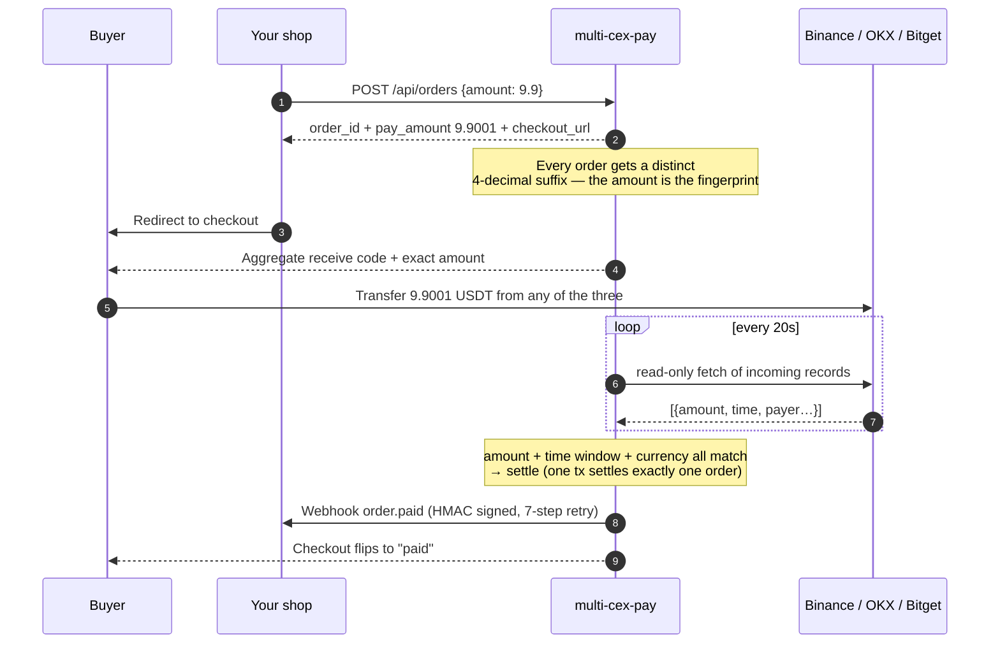

# multi-cex-pay

A self-hosted payment gateway. It polls the incoming-funds records of your
Binance Pay / OKX / Bitget accounts with read-only API keys, matches each
payment to an order, and calls your webhook once an order settles.

[](https://github.com/XXXDai/multi-cex-pay/actions/workflows/ci.yml)
[](LICENSE)
[](pyproject.toml)
[](tests/)

[Integration](docs/integration.md) · [API](docs/api.md) · [Matching](docs/matching.md) · [Security](docs/security.md) · [FAQ](docs/faq.md) · [中文](README.md)

---

## Background

Exchange merchant-payment APIs are only open to registered businesses, so an
individual cannot get one. That leaves two ways to accept USDT. Either the buyer
transfers to your own exchange account and you dig through the app every day to
work out who sent that 9.9, or you collect on-chain, which automates well but
makes the buyer pay gas, wait for confirmations and pick the right network.

This project automates the first way. It also covers three exchanges rather than
one, so buyers pay from whichever app they already use and you keep a single set
of orders.

## Supported exchanges

| | Binance Pay | OKX | Bitget |
|---|---|---|---|
| Data source | `/sapi/v1/pay/transactions` | `/api/v5/asset/deposit-history` | `/api/v2/spot/wallet/deposit-records` |
| Internal transfer (instant, no fee) | yes | yes | yes |
| On-chain deposit | not applicable | yes | yes |
| T1 unique amount (zero buyer input) | yes | yes | yes |
| T2 memo code | yes | no note field in the API | no note field in the API |
| T3 payer identifier | fuzzy nickname | withdrawal-id last 3 | UID last 3 |
| Read-only self-check | `account/apiRestrictions` | `account/config.perm` | `account/info.authorities` |

Adding a fourth exchange means implementing the four methods on
`ExchangeAdapter` plus two lines of registration. Steps are in
[CONTRIBUTING.md](CONTRIBUTING.md#如何新增一个交易所).

## Integration options

| Your situation | Approach | Work involved |
|---|---|---|
| A web page that needs a "pay with USDT" button | embedded modal | one `<script>` line |
| A backend, and you want full control of the flow | server API + webhook | two endpoints |
| You only need the amount and the QR, own UI (bot, desktop, mini program) | raw data mode | one endpoint |

All three share the same orders and the same matching logic, so you can switch
later. Details in the [integration guide](docs/integration.md). Once the gateway
is running, `/` is the integration console, and the snippets there already carry
your own gateway address.

## How it works



### Four matching tiers

| Tier | Basis | Buyer effort | Coverage |
|---|---|---|---|
| T1 unique amount | `9.9` → `9.9001`, exact equality | nothing | all three |
| T2 memo code | 6 digits in the transfer note | optional note | Binance only |
| T3 payer identifier | nickname / UID last 3 / withdrawal-id last 3 | one field at checkout | all three (different field each) |
| T4 manual settle | one click in the admin console | none | all three |

On top of the tiers there is a set of hard checks: the currency has to match,
underpayment is never settled, overpayment beyond a threshold is not settled
automatically, and the transaction has to fall inside the order's time window.
`settled_tx` also has a uniqueness constraint on `(exchange, tx_id)`, so one
incoming transaction can only ever settle one order, and neither concurrent
sweeps nor repeated polling can cross-settle.

Tuning and troubleshooting are in [docs/matching.md](docs/matching.md).

## The aggregate receive code

<div align="center">
  
</div>

QR payloads cannot be shared across exchanges. Binance encodes
`https://app.binance.com/uni-qr/...`, Bitget `https://www.bitget.com/pay/receive?...`,
and each app only understands its own domain. So what happens here is visual
aggregation: one image, three panels, scan the panel for the app you use.

To make "scan the right panel" reliable, the layout leaves gutters of at least
45% of the QR width between panels, puts a brand-coloured header bar above each
code, and decodes the finished image panel by panel to confirm all three codes
still scan.

`examples/scan_simulation.py` runs that check: it models a viewfinder at real
proportions, adds handheld tilt and camera downsampling, then assigns each
decode by domain. The result is a clean diagonal with no cross-exchange
misreads. The viewfinder has to be widened to 3.9x the QR width before it frames
two complete codes at once, and normal scanning distance is 1.2x to 2.5x.

Scanning a multi-QR image from the photo library is unreliable, since some apps
just pick one at random. The checkout page therefore defaults to a single large
code on narrow screens, and the aggregate image suits print or desktop better.

### You do not crop the codes yourself

Drop the whole screenshot of the exchange app's receive page into the admin
console. The pipeline locates the QR, corrects perspective (a photo taken at an
angle is fine), decodes it, and re-renders a clean standard code from the
payload:

<div align="center">
  
</div>

It also warns you when a code belongs to a different exchange than the slot you
filed it under, for example "this looks like a Bitget code, but you filed it
under OKX".

## Install

```bash
git clone https://github.com/XXXDai/multi-cex-pay.git && cd multi-cex-pay
python3 -m venv .venv && .venv/bin/pip install -e .
```

Docker:

```bash
cp .env.example .env && docker compose up -d
```

### Read-only keys

Create an API key in each exchange's console. Tick read only, leave trade,
withdraw and transfer unticked, and set an IP allowlist as well. The secret is
prompted interactively so it never lands in shell history:

```bash
.venv/bin/cexpay creds set binance --account-label "Pay ID 123456789"
```

Then run the self-check. It errors out on write permissions, and under the
default config the gateway also refuses to start on a key that can write:

```bash
.venv/bin/cexpay creds test
```

Which page creates the key on each exchange, and which checkboxes must stay
empty, is in [docs/security.md](docs/security.md).

### Receive codes

Screenshot the receive page in each exchange app, then:

```bash
.venv/bin/cexpay qr crop ~/Desktop/binance-shot.png -e binance
.venv/bin/cexpay qr compose -o aggregate.png --layout row
```

Or start the service and drag the images into `/admin`.

### Run

```bash
export CEXPAY_ADMIN_TOKEN=$(openssl rand -hex 24)
export CEXPAY_WEBHOOK_SECRET=$(openssl rand -hex 24)
.venv/bin/cexpay serve
```

| URL | Purpose |
|---|---|
| `http://127.0.0.1:8787/` | integration console, snippets and a test order |
| `http://127.0.0.1:8787/admin` | credentials, receive codes, aggregate, orders, deposits |
| `http://127.0.0.1:8787/docs` | generated OpenAPI reference |

### Wiring it into your app

The shortest path is one script tag:

```html
<script src="https://your-gateway/embed.js"></script>
<script>
  CexPay.open({ orderId, onPaid: o => location.href = '/thanks' });
</script>
```

The modal handles exchange selection, the QR, the countdown, polling and
auto-close, follows its content height, and switches to a single large code on
phones. The other two approaches are covered in the
[integration guide](docs/integration.md).

Verify the signature before you handle a callback, then be idempotent on
`order_id`. You can get verification working locally without waiting for a real
payment:

```bash
cexpay webhook-test http://127.0.0.1:5000/webhook
```

```python
from cexpay_client import CexPayClient          # sdk/python/cexpay_client.py

client = CexPayClient("http://127.0.0.1:8787", webhook_secret="...")
res = client.create_order("9.9", merchant_ref="SHOP-1001",
                          callback_url="https://myshop.com/webhook")
redirect_to(res["checkout_url"])

# in your webhook handler — verify first, then be idempotent on order_id
if not client.verify_webhook(raw_body, ts_header, sig_header):
    return 400
```

There are four SDKs: Python, Node, PHP and Go, all in [`sdk/`](sdk/), single
file and no third-party dependencies.
[`tests/test_sdk_signature.py`](tests/test_sdk_signature.py) checks all four
against the server's signature, so a broken SDK fails CI. For another language,
generate a client from `cexpay openapi -o openapi.json`.

The endpoint list is in [docs/api.md](docs/api.md), and runnable samples are in
[examples/](examples/).

## CLI

```
cexpay serve                              start the service
cexpay creds list|set|test                manage credentials, read-only self-check
cexpay qr scan <image>                    print every QR in the image and its exchange
cexpay qr crop <image> -e binance         crop the receive code and store it
cexpay qr compose -o all.png --layout row build the aggregate image with read-back check
cexpay order create 9.9                   open an order
cexpay order check <order_id>             run one settlement pass now
cexpay tx --minutes 60                    show recent incoming funds per exchange
cexpay webhook-test <callback-url>        send a correctly signed fake callback
cexpay openapi -o openapi.json            export OpenAPI
```

## Trade-offs

**Why the amount gets a suffix.** It is the only way to get zero buyer input and
automatic settlement at the same time. Four decimals allow 9999 concurrent
orders at one price, and an allocated amount stays locked for 24 hours so a
buyer who pays a day late cannot cross-settle a newer order. You can turn it off
(`CEXPAY_UNIQUE_AMOUNT=false`) at the cost of requiring a payer identifier.

**Why read-only is enough.** The service never needs to move money. It only
reads incoming records, and does not transfer, withdraw or trade. Under the
default config it validates key permissions at startup and refuses to run on a
key that can withdraw or trade.

**Why Python rather than a single binary.** QR detection and cropping rely on
OpenCV and Pillow. The cost is a heavier deploy than a Go binary, which is why
there is a Docker image.

**What it does not do.** No multi-tenancy. No refunds, since the exchanges
expose no such API to individuals. No on-chain collection: for that use
something like [epusdt](https://github.com/assimon/epusdt), which can run
alongside this.

## Risk

- This project has no affiliation with Binance, OKX or Bitget. Those names only
  describe which channel the money arrives through.
- It calls each exchange's public read-only endpoints only. No login emulation,
  no reverse engineering of private protocols, and it never initiates a transfer.
- Using a personal account as a commercial payment channel over time may breach
  the exchange's terms of service, and the account can be restricted. That risk
  comes from running a business on a personal account, not from the
  implementation, and the operator decides whether to accept it.
- Do not use it for anything illegal.

## Development

```bash
.venv/bin/pip install -e ".[dev]"
.venv/bin/python -m pytest -q        # 254 passed
.venv/bin/ruff check .
```

The tests cover every matching tier and its edge cases, the storage-layer
invariant that one incoming transaction settles one order, parsing and
permission checks for the three adapters (fake response bodies, no real API
calls), the whole QR path from screenshot to crop to aggregate to read-back, the
embedded checkout's integration contract, and signature consistency across the
four SDKs.

PRs welcome, see [CONTRIBUTING.md](CONTRIBUTING.md).

## License

[MIT](LICENSE)
