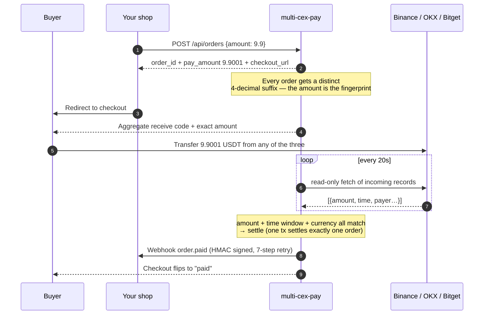
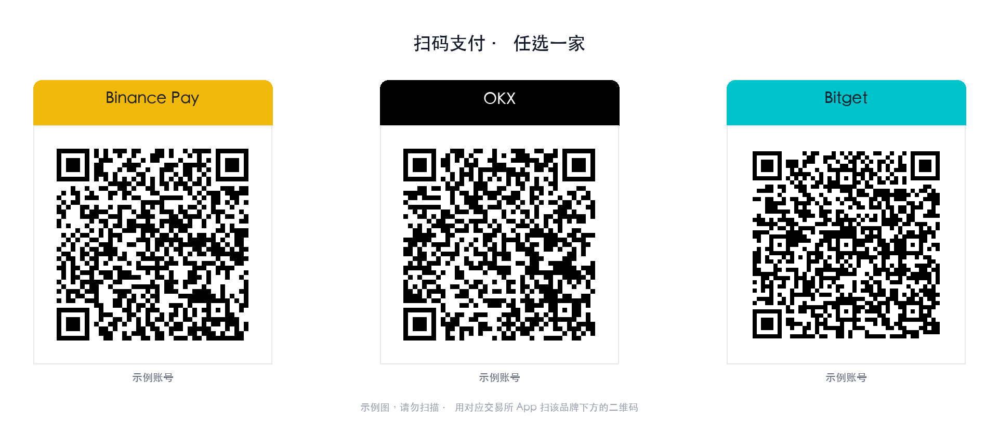
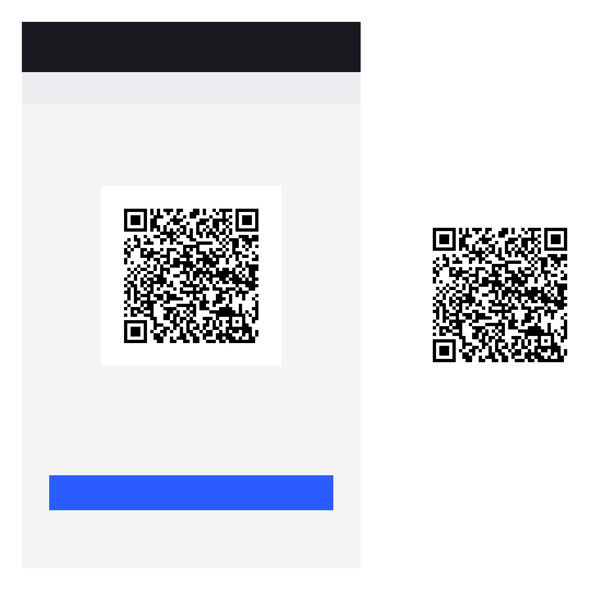

<div align="center">

# multi-cex-pay

**A self-hosted payment gateway that lets a personal account accept USDT over
Binance Pay / OKX / Bitget — and settles the orders for you.**

Read-only API keys only · never touches your funds · one image aggregating three
receive codes · drop in a screenshot and it crops the QR itself

[](https://github.com/XXXDai/multi-cex-pay/actions/workflows/ci.yml)
[](LICENSE)
[](pyproject.toml)
[](tests/)

[Quick start](#quick-start) · [How it works](#how-it-works) · [Aggregate QR](#the-aggregate-receive-code) · [Integration](docs/integration.md) · [API](docs/api.md) · [Security](docs/security.md) · [中文](README.md)

</div>

---

## The problem

Exchange merchant-payment APIs are only available to **registered businesses**.
An individual seller who wants to accept USDT is usually left with two options:

- **Have the buyer transfer to your exchange account** — free and instant, but then you
  manually dig through the app to work out *who* sent that 9.9; or
- **Accept on-chain** — automatable, but the buyer pays gas, waits for confirmations,
  and has to pick the right network.

This project takes the first option and automates the manual part: it polls your account's
incoming-funds records with a **read-only** API key and settles orders automatically by
unique amount, memo code, or payer identifier — then calls your webhook.

**What sets it apart: three exchanges, not one.** Buyers pay from whichever exchange
they already use, and you maintain a single set of orders.

---

## Support matrix

| | Binance Pay | OKX | Bitget |
|---|---|---|---|
| Data source | `/sapi/v1/pay/transactions` | `/api/v5/asset/deposit-history` | `/api/v2/spot/wallet/deposit-records` |
| Internal transfer (instant, no fee) | ✅ | ✅ | ✅ |
| On-chain deposit | — | ✅ | ✅ |
| **T1 unique amount** (zero input) | ✅ | ✅ | ✅ |
| **T2 memo code** | ✅ | ✕ no note field | ✕ no note field |
| **T3 payer identifier** | fuzzy nickname | withdrawal-id last 3 | UID last 3 |
| Read-only self-check | `account/apiRestrictions` | `account/config.perm` | `account/info.authorities` |

Adding a fourth exchange means implementing four methods on `ExchangeAdapter` plus two
lines of registration — see [CONTRIBUTING.md](CONTRIBUTING.md).

---

## How it works



### Four matching tiers, from zero-input to manual

| Tier | Basis | Buyer effort | Coverage |
|---|---|---|---|
| **T1 unique amount** | `9.9` → `9.9001`, exact equality | nothing | all three |
| **T2 memo code** | 6 digits in the transfer note | optional note | Binance only |
| **T3 payer identifier** | nickname / UID last 3 / withdrawal-id last 3 | one field at checkout | all three |
| **T4 manual settle** | one click in the admin console | — | all three |

Every tier is additionally gated on: matching currency, **underpayment always rejected**,
overpayment beyond a threshold not auto-settled, and the transaction falling inside the
order's time window. `settled_tx` has a uniqueness constraint on `(exchange, tx_id)`, so
**one incoming transaction can only ever settle one order** — concurrent sweeps cannot
cross-settle. Details in [docs/matching.md](docs/matching.md).

---

## The aggregate receive code

<div align="center">
  
</div>

### One image — with an honest caveat

**QR payloads cannot be shared across exchanges.** Binance encodes
`https://app.binance.com/uni-qr/...`, Bitget `https://www.bitget.com/pay/receive?...`;
each app only understands its own domain. "Aggregation" here means **visual** aggregation:
one image, three panels, scan the panel for the app you use. Anybody claiming a single
"universal code" that all three apps resolve is wrong.

To make "scan the right panel" actually reliable, the layout does three things:

1. gutters of **≥ 45% of the QR width**, so a phone viewfinder framing one panel excludes
   its neighbours;
2. a brand-coloured header bar above each code, so it is obvious by eye;
3. a **read-back check** — the finished image is decoded again to confirm all three codes
   are still scannable and unchanged.

> Scanning a multi-QR image **from the photo library** is unreliable: some apps just pick
> one arbitrarily. The checkout page therefore defaults to a **single large code on narrow
> screens**; the aggregate image is better suited to print or desktop.

### You do not crop the codes yourself

Drop the **whole screenshot** of the exchange app's receive page into the admin console.
The pipeline locates the QR, corrects perspective (a photo taken at an angle is fine),
decodes it, and re-renders a clean standard code from the payload:

<div align="center">
  
</div>

It will also tell you when a code looks like it belongs to a different exchange than the
slot you filed it under.

---

## Quick start

```bash
git clone https://github.com/XXXDai/multi-cex-pay.git && cd multi-cex-pay
python3 -m venv .venv && .venv/bin/pip install -e .

# 1. read-only credentials (secret is prompted, never lands in shell history)
.venv/bin/cexpay creds set binance --account-label "Pay ID 123456789"
.venv/bin/cexpay creds test          # refuses keys that can trade or withdraw

# 2. receive codes, straight from app screenshots
.venv/bin/cexpay qr crop ~/Desktop/binance-shot.png -e binance
.venv/bin/cexpay qr compose -o aggregate.png --layout row

# 3. run
export CEXPAY_ADMIN_TOKEN=$(openssl rand -hex 24)
export CEXPAY_WEBHOOK_SECRET=$(openssl rand -hex 24)
.venv/bin/cexpay serve
```

Or with Docker: `cp .env.example .env && docker compose up -d`

| URL | Purpose |
|---|---|
| `http://127.0.0.1:8787/` | landing page, creates a test order |
| `http://127.0.0.1:8787/admin` | credentials, receive codes, aggregate, orders, deposits |
| `http://127.0.0.1:8787/docs` | generated OpenAPI reference |

### Integrating

The shortest path is a single script tag — the modal handles exchange selection, the QR,
the countdown, polling and auto-close:

```html
<script src="https://your-gateway/embed.js"></script>
<script>
  CexPay.open({ orderId, onPaid: o => location.href = '/thanks' });
</script>
```

Two other paths (server API + webhook, or raw data with your own UI) are covered in the
**[integration guide](docs/integration.md)**. You can get webhook verification working
locally without waiting for a real payment:

```bash
cexpay webhook-test http://127.0.0.1:5000/webhook
```


```python
from cexpay_client import CexPayClient          # sdk/python/cexpay_client.py

client = CexPayClient("http://127.0.0.1:8787", webhook_secret="...")
res = client.create_order("9.9", merchant_ref="SHOP-1001",
                          callback_url="https://myshop.com/webhook")
redirect_to(res["checkout_url"])

# in your webhook handler — verify first, then be idempotent on order_id
if not client.verify_webhook(raw_body, ts_header, sig_header):
    return 400
```

SDKs for **Python / Node / PHP / Go** live in [`sdk/`](sdk/) with zero third-party
dependencies. [`tests/test_sdk_signature.py`](tests/test_sdk_signature.py) checks all four
against the server's signature, so a broken SDK fails CI.

---

## Design trade-offs

**Why the amount gets a suffix.** It is the only way to get zero buyer input *and*
automatic settlement. Four decimals allow 9999 concurrent orders at one price, and each
allocated amount is locked for 24 hours so a late payer cannot cross-settle a newer order.
You can turn it off (`CEXPAY_UNIQUE_AMOUNT=false`) at the cost of requiring a payer
identifier.

**Why read-only is enough.** The service never needs to move money: it only *reads*
incoming records. By default it validates key permissions at startup and refuses to run on
a key that can withdraw or trade.

**Why Python rather than a single binary.** QR detection and cropping rely on OpenCV and
Pillow, and that capability is a core part of this project. The cost is a heavier deploy
than a Go binary — hence the Docker image.

**What it deliberately does not do.** No multi-tenancy, no refunds (exchanges expose no
such API to individuals), no on-chain collection — for on-chain use something like
[epusdt](https://github.com/assimon/epusdt) alongside it.

---

## Risk and disclaimer

- **Not affiliated with Binance, OKX or Bitget.** Those names describe the payment channel
  only; they imply no authorisation or endorsement.
- Uses each exchange's **public read-only endpoints** only. No login emulation, no reverse
  engineering, and it never initiates a transfer.
- **Using a personal account as a commercial payment channel may breach the exchange's
  terms of service** and can lead to account restrictions. The operator carries that risk.
- Do not use it for anything illegal.

## Development

```bash
.venv/bin/pip install -e ".[dev]"
.venv/bin/python -m pytest -q        # 207 passed
.venv/bin/ruff check .
```

## License

[MIT](LICENSE)
