# 多交易所聚合支付

自托管的收款网关。用只读 API Key 轮询 Binance Pay / OKX / Bitget 的进账记录，
把钱自动配到订单上，配上了就回调你的业务系统。

[](https://github.com/XXXDai/multi-cex-pay/actions/workflows/ci.yml)
[](LICENSE)
[](pyproject.toml)
[](tests/)

[接入指南](docs/integration.md) · [API](docs/api.md) · [核销原理](docs/matching.md) · [安全](docs/security.md) · [FAQ](docs/faq.md) · [English](README.en.md)

---

## 起因

交易所的商户收款 API 只对企业主体开放，个人拿不到。所以个人卖家想收 USDT，
要么让买家转到自己的交易所账号，然后每天人肉去 App 里核对"这笔 9.9 是谁付的"；
要么走链上，能自动化，但买家得付 gas、等确认、选对链。

这个项目做的是第一条路的自动化部分。三家交易所都支持，买家用哪个所都能付，
你这边只有一套订单。

## 支持范围

| | Binance Pay | OKX | Bitget |
|---|---|---|---|
| 数据来源 | `/sapi/v1/pay/transactions` | `/api/v5/asset/deposit-history` | `/api/v2/spot/wallet/deposit-records` |
| 内部转账（秒到、免手续费） | 支持 | 支持 | 支持 |
| 链上充值 | 不适用 | 支持 | 支持 |
| T1 唯一金额（用户零输入） | 支持 | 支持 | 支持 |
| T2 备注码 | 支持 | 接口无备注字段 | 接口无备注字段 |
| T3 付款方标识 | 昵称模糊匹配 | 提币申请 ID 后三位 | UID 后三位 |
| 只读权限自检 | `account/apiRestrictions` | `account/config.perm` | `account/info.authorities` |

接第四家的话，实现 `ExchangeAdapter` 的四个方法再注册两行就行，
步骤在 [CONTRIBUTING.md](CONTRIBUTING.md#如何新增一个交易所)。

## 怎么接

| 你的情况 | 接法 | 改动量 |
|---|---|---|
| 有个网页，想加个「USDT 支付」按钮 | 嵌入式弹窗 | 一行 `<script>` |
| 有后端，想完全控制流程 | 服务端 API + Webhook | 两个接口 |
| 只要金额和二维码，UI 自己画（Bot、桌面端、小程序） | 纯数据模式 | 一个接口 |

三种共用同一套订单和核销逻辑，随时可以换。细节看 [接入指南](docs/integration.md)。
网关跑起来后打开 `/` 是接入控制台，里面的代码片段已经填好了你自己的网关地址。

## 流程

```mermaid
sequenceDiagram
    autonumber
    participant B as 买家
    participant S as 你的商城
    participant G as 聚合支付网关
    participant X as Binance / OKX / Bitget

    S->>G: POST /api/orders {amount: 9.9}
    G-->>S: order_id + pay_amount 9.9001 + checkout_url
    Note over G: 每笔订单分到不同的 4 位小数尾数，<br/>金额本身就是订单指纹
    S->>B: 跳转收银台
    G-->>B: 聚合收款码 + 精确到分的金额
    B->>X: 用任意一家 App 转 9.9001 USDT
    loop 每 20s
        G->>X: 只读拉取进账记录
        X-->>G: [{amount, time, payer…}]
    end
    Note over G: 金额、时间窗、币种全对上就核销，<br/>一笔流水只核销一张单
    G->>S: Webhook order.paid（HMAC 签名，失败重试 7 次）
    G-->>B: 收银台变成「支付成功」
```



### 四层匹配

| 层级 | 依据 | 买家要做什么 | 支持范围 |
|---|---|---|---|
| T1 唯一金额 | `9.9` → `9.9001`，金额精确相等 | 什么都不用做 | 三家 |
| T2 备注码 | 转账备注里的 6 位数字 | 选填备注 | 仅 Binance |
| T3 付款方标识 | 昵称 / UID 后三位 / 提币 ID 后三位 | 在收银台补填一项 | 三家（字段各不同） |
| T4 人工核销 | 后台点一下 | 无 | 三家 |

每层之外还有一组共同的硬校验：币种要一致，少付一律不通过，多付超过阈值不自动核销，
交易时间要落在订单的时间窗内。另外 `settled_tx` 表对 `(exchange, tx_id)` 有唯一约束，
一笔进账只可能核销一张订单，并发和重复轮询都串不了单。

调参和排查见 [docs/matching.md](docs/matching.md)。

## 聚合收款码

<div align="center">
  
</div>

二维码没法跨所通用。Binance 的码是 `https://app.binance.com/uni-qr/...`，
Bitget 的是 `https://www.bitget.com/pay/receive?...`，各家 App 只认自己的域名。
所以这里做的是视觉聚合：一张图三格，用哪家 App 就扫哪一格。

为了让"扫哪一格"可靠，格与格之间留出不小于码宽 45% 的白边，每格顶上压一条
品牌色标题栏；合成之后再把成图逐格解一遍，确认三个码都还扫得出来。

`examples/scan_simulation.py` 把这个验证跑出来了：按真实比例模拟取景框、加上手持倾斜
和摄像头下采样，再按域名判定归属，结果是干净的对角线，没有跨所误识别。
取景框要放大到码宽的 3.9 倍才会同时框进两个完整的码，而正常扫码距离是 1.2 到 2.5 倍。

从相册识别多码图不可靠，部分 App 会随机取一个。收银台因此在窄屏默认单码大图，
聚合图更适合打印张贴或桌面端。

### 收款码不用自己裁

把交易所 App 收款页的整张截图丢进后台就行。系统会定位二维码、透视校正（拍歪的也能处理）、
解出内容、按原文重绘成一张标准码：

<div align="center">
  
</div>

传错所会提示，比如"这张码看起来是 Bitget 的，但你配到了 OKX"。

## 装起来

```bash
git clone https://github.com/XXXDai/multi-cex-pay.git && cd multi-cex-pay
python3 -m venv .venv && .venv/bin/pip install -e .
```

Docker：

```bash
cp .env.example .env && docker compose up -d
```

### 配只读 Key

在各交易所后台创建 API Key，只勾读取，别勾交易、提币、划转，建议同时设 IP 白名单。
Secret 走交互输入，不会留在 shell history 里：

```bash
.venv/bin/cexpay creds set binance --account-label "Pay ID 123456789"
```

然后自检。发现写权限会直接报错，默认配置下网关也拒绝带写权限的 Key 启动：

```bash
.venv/bin/cexpay creds test
```

各所具体在哪个页面创建、哪些勾选框必须留空，见 [docs/security.md](docs/security.md)。

### 配收款码

截图交易所 App 的收款页，然后：

```bash
.venv/bin/cexpay qr crop ~/Desktop/binance-shot.png -e binance
.venv/bin/cexpay qr compose -o aggregate.png --layout row
```

或者启动服务后把图拖进 `/admin`。

### 跑

```bash
export CEXPAY_ADMIN_TOKEN=$(openssl rand -hex 24)
export CEXPAY_WEBHOOK_SECRET=$(openssl rand -hex 24)
.venv/bin/cexpay serve
```

| 地址 | 用途 |
|---|---|
| `http://127.0.0.1:8787/` | 接入控制台，代码片段和自测下单 |
| `http://127.0.0.1:8787/admin` | 凭据、收款码、聚合图、订单、进账排查 |
| `http://127.0.0.1:8787/docs` | 自动生成的 OpenAPI 文档 |

### 接进业务

最短的接法是一行 script：

```html
<script src="https://你的网关/embed.js"></script>
<script>
  CexPay.open({ orderId, onPaid: o => location.href = '/thanks' });
</script>
```

弹窗自己处理选交易所、二维码、倒计时、轮询、成功后关闭，高度跟随内容，
手机上自动切单码大图。另外两种接法见 [接入指南](docs/integration.md)。

收回调时先验签，再按 `order_id` 幂等处理。验签不用等真有人付款，本地就能调通：

```bash
cexpay webhook-test http://127.0.0.1:5000/webhook
```

SDK 有 Python、Node、PHP、Go 四个版本，都在 [`sdk/`](sdk/)，单文件零依赖。
四边的签名口径由 [`tests/test_sdk_signature.py`](tests/test_sdk_signature.py) 跨语言对齐，
改坏了 CI 会红。要别的语言就 `cexpay openapi -o openapi.json` 自己生成。

接口清单见 [docs/api.md](docs/api.md)，可运行示例在 [examples/](examples/)。

## 命令行

```
cexpay serve                              启动服务
cexpay creds list|set|test                管理凭据、只读权限自检
cexpay qr scan <图>                        打印图里所有二维码的内容和归属
cexpay qr crop <图> -e binance             自动裁出收款码并存好
cexpay qr compose -o all.png --layout row 生成聚合图，附回读校验
cexpay order create 9.9                   开一笔订单
cexpay order check <order_id>             立刻核销一次
cexpay tx --minutes 60                    看各所最近进账
cexpay webhook-test <回调地址>              发一条签名正确的假回调
cexpay openapi -o openapi.json            导出 OpenAPI
```

## 几个取舍

**金额为什么要加尾数。** 这是唯一能做到买家零输入还能自动核销的办法。
4 位小数意味着同一价位可以并发 9999 笔订单；金额被占用后还有 24 小时冷却，
免得有人隔天才付款串到新订单上。不想改金额可以关掉（`CEXPAY_UNIQUE_AMOUNT=false`），
代价是必须让买家填付款方标识。

**为什么只要只读权限。** 这个服务不需要动钱的能力，它只读进账记录，
转账、提币、下单一个都不做。默认配置会在启动时校验 Key 权限，能提币或交易就拒绝启动。

**为什么是 Python 不是单二进制。** 二维码的识别和裁剪依赖 OpenCV 和 Pillow，
这部分是项目的核心能力之一。代价是部署比一个 Go 二进制重，所以给了 Docker 镜像。

**没做的事。** 不做多商户；不做退款（交易所没给个人提供对应接口）；
不做链上收款，要链上就用 [epusdt](https://github.com/assimon/epusdt) 那类项目，
两者不冲突，可以同时挂着。

## 风险

- 本项目与 Binance、OKX、Bitget 都没有任何关联。出现这些名字只是在说明钱从哪条通道来。
- 只调用各所公开的只读接口，不模拟登录、不逆向私有协议、不发起任何转账。
- 用个人账户长期承接经营性收款，可能不符合交易所的用户协议，存在账号被风控或限制的可能。
  这个风险来自"用个人账号做生意"本身，和技术实现无关，是否使用由部署者自行判断。
- 不要用它做违法的事。

## 开发

```bash
.venv/bin/pip install -e ".[dev]"
.venv/bin/python -m pytest -q        # 250 passed
.venv/bin/ruff check .
```

测试覆盖匹配引擎的每一层和边界、存储层的"一笔钱只核销一张单"不变量、
三家适配器的解析和权限判定（假响应体，不打真实接口）、二维码全链路
（截图到裁剪到聚合到回读）、嵌入式收银台的接入契约，以及四种语言 SDK 的签名一致性。

欢迎 PR，见 [CONTRIBUTING.md](CONTRIBUTING.md)。

## License

[MIT](LICENSE)
