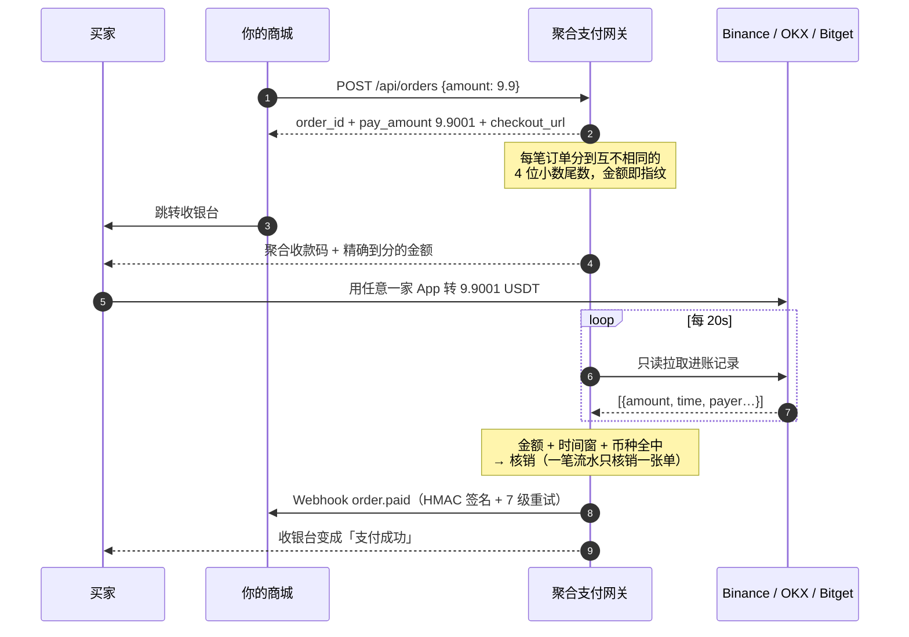

<div align="center">

# 多交易所聚合支付

**一套自托管的收款网关：让个人账户能收 Binance Pay / OKX / Bitget 的 USDT，并自动核销订单。**

只用**只读** API Key · 永不碰你的钱 · 一张图聚合三家收款码 · 截图丢进去自动裁剪

[](https://github.com/XXXDai/multi-cex-pay/actions/workflows/ci.yml)
[](LICENSE)
[](pyproject.toml)
[](tests/)
[](#支持矩阵)

[快速开始](#快速开始) · [它怎么工作](#它怎么工作) · [聚合收款码](#聚合收款码) · [API](docs/api.md) · [安全](docs/security.md) · [FAQ](docs/faq.md) · [English](README.en.md)

</div>

---

## 这个项目解决什么问题

交易所的商户收款 API 只对**企业主体**开放。个人卖家想收 USDT，通常只有两条路：

- **让买家转到你的交易所账号** —— 免手续费、秒到，但到账后要人肉去 App 里核对"这笔 9.9 是谁付的"；
- **走链上收款** —— 可以自动化，但买家要付 gas、要等确认、要选对链，转错链就没了。

本项目走第一条路，把人肉核对那一步自动化：用**只读** API Key 轮询你账户的进账记录，
按「唯一金额 / 备注码 / 付款方标识」自动把钱配到订单上，配上了就回调你的业务系统。

**和同类项目的区别：三家而不是一家。** 买家用哪个所都能付，你只维护一套订单。

---

## 支持矩阵

| | Binance Pay | OKX | Bitget |
|---|---|---|---|
| 数据来源 | `/sapi/v1/pay/transactions` | `/api/v5/asset/deposit-history` | `/api/v2/spot/wallet/deposit-records` |
| 内部转账（秒到、免手续费） | ✅ | ✅ | ✅ |
| 链上充值 | — | ✅ | ✅ |
| **T1 唯一金额**（零输入） | ✅ | ✅ | ✅ |
| **T2 备注码** | ✅ | ✕ 接口无备注字段 | ✕ 接口无备注字段 |
| **T3 付款方标识** | 昵称模糊匹配 | 提币申请 ID 后三位 | UID 后三位 |
| 只读权限自检 | `account/apiRestrictions` | `account/config.perm` | `account/info.authorities` |

> 想接第四家？实现 `ExchangeAdapter` 的四个方法 + 注册两行，见
> [CONTRIBUTING.md](CONTRIBUTING.md#如何新增一个交易所)。

---

## 它怎么工作



### 四层匹配，从零输入到人工兜底

| 层级 | 依据 | 买家要做什么 | 支持范围 |
|---|---|---|---|
| **T1 唯一金额** | `9.9` → `9.9001`，金额精确相等 | 什么都不用做 | 三家 |
| **T2 备注码** | 转账备注里的 6 位数字 | 选填备注 | 仅 Binance |
| **T3 付款方标识** | 昵称 / UID 后三位 / 提币 ID 后三位 | 在收银台补填一项 | 三家（各不同） |
| **T4 人工核销** | 后台点一下 | — | 三家 |

每一层都还要过同一组硬校验：**币种一致**、**少付一律不通过**、多付超过阈值不自动核销、
交易时间落在订单时间窗内。并且 `settled_tx` 表对 `(exchange, tx_id)` 建了唯一约束——
**一笔进账永远只能核销一张订单**，并发和重复轮询都串不了单。

细节和调参见 [docs/matching.md](docs/matching.md)。

---

## 聚合收款码

<div align="center">
  
</div>

### 一张图，但先把话说清楚

**二维码没法跨所通用。** Binance 的码是 `https://app.binance.com/uni-qr/...`，
Bitget 的是 `https://www.bitget.com/pay/receive?...`，各家 App 只认自己的域名。
所谓"聚合"是**视觉聚合**：一张图上三格，用哪家 App 就扫哪一格。任何声称能做出
"三家通吃的万能码"的说法都是假的。

为了让"扫哪一格"真的可靠，排版上做了三件事：

1. 格与格之间留 **≥ 码宽 45%** 的白边，手机取景框自然只框得住一格；
2. 每格顶上压一条品牌色标题栏，肉眼一眼分辨；
3. 合成后**回读校验**——把成图重新解一遍，确认三个码都还扫得出、内容没变。

> 从**相册**识别多码图时，部分 App 会随机取其中一个，这条路不可靠。
> 收银台因此在窄屏（手机）默认走**单码大图**，聚合图更适合打印张贴或桌面端。

### 收款码不用自己裁

直接把交易所 App 收款页的**整张截图**丢进后台。系统会定位二维码 → 透视校正（拍歪的也行）
→ 解出内容 → 按原文重绘成一张干净的标准码：

<div align="center">
  
</div>

还会顺手告诉你"这张码看起来是 Bitget 的，但你配到了 OKX"。

---

## 快速开始

### 1. 装

```bash
git clone https://github.com/XXXDai/multi-cex-pay.git && cd multi-cex-pay
python3 -m venv .venv && .venv/bin/pip install -e .
```

或者用 Docker：

```bash
cp .env.example .env && docker compose up -d
```

### 2. 配只读 Key

在各交易所后台创建 API Key，**只勾读取，别勾交易/提币/划转**，建议同时设 IP 白名单。
逐个交易所走一遍（Secret 走交互输入，不会留在 shell history 里）：

```bash
.venv/bin/cexpay creds set binance --account-label "Pay ID 123456789"
```

然后自检——发现写权限会直接报错，默认配置下网关也拒绝带写权限的 Key 启动：

```bash
.venv/bin/cexpay creds test
```

各所具体在哪个页面创建、哪些勾选框必须留空，见 [docs/security.md](docs/security.md)。

### 3. 配收款码

截图交易所 App 的收款页，然后：

```bash
.venv/bin/cexpay qr crop ~/Desktop/binance-shot.png -e binance
.venv/bin/cexpay qr compose -o aggregate.png --layout row
```

或者启动服务后直接把图拖进 `/admin` 页面。

### 4. 跑

```bash
export CEXPAY_ADMIN_TOKEN=$(openssl rand -hex 24)
export CEXPAY_WEBHOOK_SECRET=$(openssl rand -hex 24)
.venv/bin/cexpay serve
```

| 地址 | 用途 |
|---|---|
| `http://127.0.0.1:8787/` | 首页，可以直接开一笔测试订单 |
| `http://127.0.0.1:8787/admin` | 后台：凭据、收款码、聚合图、订单、进账排查 |
| `http://127.0.0.1:8787/docs` | 自动生成的 OpenAPI 文档 |

### 5. 接进你的业务

```python
from cexpay_client import CexPayClient          # sdk/python/cexpay_client.py

client = CexPayClient("http://127.0.0.1:8787", webhook_secret="...")
res = client.create_order("9.9", merchant_ref="SHOP-1001",
                          callback_url="https://myshop.com/webhook")
redirect_to(res["checkout_url"])
```

收到回调时先验签，再按 `order_id` 幂等处理：

```python
if not client.verify_webhook(raw_body, ts_header, sig_header):
    return 400
```

SDK 有 **Python / Node / PHP / Go** 四个版本，都在 [`sdk/`](sdk/)，零第三方依赖。
签名口径由 [`tests/test_sdk_signature.py`](tests/test_sdk_signature.py) 跨语言对齐，改坏了 CI 会红。

完整接口见 [docs/api.md](docs/api.md)，可运行示例见 [examples/](examples/)。

---

## 命令行

```
cexpay serve                              启动服务
cexpay creds list|set|test                管理凭据 / 只读权限自检
cexpay qr scan <图>                        打印图里所有二维码的内容和归属
cexpay qr crop <图> -e binance             自动裁出收款码并存好
cexpay qr compose -o all.png --layout row 生成聚合图（含回读校验）
cexpay order create 9.9                   开一笔订单
cexpay order check <order_id>             立刻核销一次
cexpay tx --minutes 60                    看各所最近进账（排查神器）
```

---

## 设计上的几个取舍

**为什么金额要加尾数。** 这是唯一能做到"买家零输入 + 自动核销"的办法。
4 位小数 = 同一价位可以并发 9999 笔订单；金额被占用后还有 24 小时冷却，
避免有人隔天才付款串到新订单上。不想改金额可以关掉（`CEXPAY_UNIQUE_AMOUNT=false`），
代价是必须让买家填付款方标识。

**为什么只要只读权限。** 这个服务从设计上就不需要动钱的能力：它只**读**进账记录，
转账、提币、下单一个都不做。默认配置会在启动时校验 Key 权限，发现能提币/交易就拒绝启动。

**为什么是 Python 而不是单二进制。** 二维码识别和裁剪依赖 OpenCV + Pillow，
这部分是本项目的核心能力之一。代价是部署比一个 Go 二进制重——所以给了 Docker 镜像。

**没做什么。** 不做多商户 / 多租户；不做退款（交易所没有对应的只读之外的接口给个人）；
不做链上收款（要链上就用 [epusdt](https://github.com/assimon/epusdt) 这类项目，
和本项目并不冲突，可以同时挂）。

---

## 风险与免责声明

- 本项目**与 Binance、OKX、Bitget 均无任何关联**。出现这些名字只是在说明"钱从哪条通道来"，
  不代表任何形式的授权或背书。
- 只调用各所**公开的只读接口**，不模拟登录、不逆向私有协议、不发起任何转账。
- **用个人账户长期承接经营性收款，可能不符合交易所的用户协议**，存在账号被风控或限制的可能。
  是否使用、如何使用，风险由部署者自行承担。
- 不要用它做任何违法的事。

---

## 开发

```bash
.venv/bin/pip install -e ".[dev]"
.venv/bin/python -m pytest -q        # 178 passed
.venv/bin/ruff check .
```

测试覆盖了匹配引擎的每一层与边界、存储层的"一笔钱只核销一张单"不变量、
三家适配器的解析与权限判定（假响应体，不打真实接口）、二维码全链路（截图→裁剪→聚合→回读），
以及四种语言 SDK 的签名一致性。欢迎 PR，见 [CONTRIBUTING.md](CONTRIBUTING.md)。

## License

[MIT](LICENSE)
