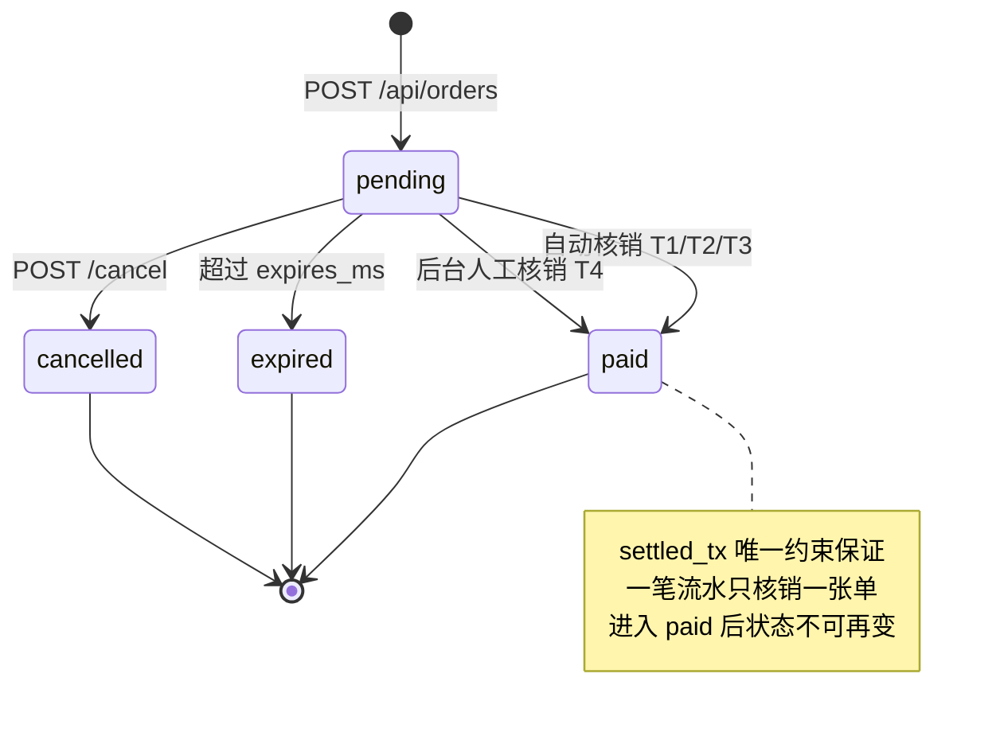

# HTTP API 参考

所有接口都在 `cexpay/server.py` 里定义。服务启动后 `http://127.0.0.1:8787/docs`
有一份自动生成的 OpenAPI 文档可以直接试调；本文补充的是默认值、边界条件和错误语义。

- [约定](#约定)
- [公开接口](#公开接口)
- [后台接口](#后台接口)
- [订单对象](#订单对象)
- [Webhook](#webhook)
- [状态机](#状态机)
- [限制与配额](#限制与配额)

---

## 约定

| 项 | 值 |
|---|---|
| Base URL | `http://127.0.0.1:8787`（默认只听本机） |
| 请求体 | `application/json`，除文件上传是 `multipart/form-data` |
| 字符编码 | UTF-8 |
| 金额 | 一律用字符串传递，服务端用 `Decimal` 解析。别用浮点数 |
| 时间 | Unix 毫秒整数（字段名以 `_ms` 结尾）；Webhook 头里的时间戳是秒 |

### 鉴权

| 路由前缀 | 鉴权 |
|---|---|
| `/api/health`、`/api/exchanges`、`/api/orders/**`、`/api/qr/aggregate.png` | 无 |
| `/api/admin/**` | `Authorization: Bearer <CEXPAY_ADMIN_TOKEN>`，或 `X-Admin-Token: <token>` |

令牌比对用 `secrets.compare_digest`（定时安全）。

`CEXPAY_ADMIN_TOKEN` 未设置时，所有后台接口返回 503 `未设置 CEXPAY_ADMIN_TOKEN，后台接口已禁用`。
这是刻意的，避免无令牌裸奔。

### 错误体

统一形状，永远只有一个 `detail` 字段：

```json
{ "detail": "订单不存在" }
```

| 状态码 | 含义 |
|---|---|
| `400` | 参数非法、订单状态不允许该操作、二维码识别失败 |
| `401` | 后台令牌不正确 |
| `404` | 订单 / 交易所 / 收款码不存在 |
| `422` | Pydantic 层的字段校验失败（缺字段、类型不对、超出 `ge/le` 范围） |
| `502` | 调用交易所接口失败 |
| `503` | 后台未启用（没设 `CEXPAY_ADMIN_TOKEN`） |

---

## 公开接口

### `GET /api/health`

存活探针。Docker 的 `HEALTHCHECK` 打的就是这个。

```bash
curl -s http://127.0.0.1:8787/api/health
```

```json
{
  "ok": true,
  "version": "0.1.0",
  "exchanges": ["binance", "okx", "bitget"],
  "poller": true
}
```

`exchanges` 是凭据完整且启用中的交易所；`poller` 为 `false` 说明
`CEXPAY_POLL_INTERVAL=0`，此时只能靠 `/check` 或后台 `/sweep` 手动核销。

---

### `GET /api/exchanges`

收银台用它决定"显示哪几个支付方式、每个方式让用户填什么"。

```bash
curl -s http://127.0.0.1:8787/api/exchanges
```

```json
{
  "exchanges": [
    {
      "name": "binance",
      "display_name": "Binance Pay",
      "brand_color": "#F0B90B",
      "supports_memo": true,
      "pay_hint": "打开币安 App → Pay → 扫一扫，或直接向收款 Pay ID 转账",
      "identifier": {
        "kind": "payer_name",
        "label": "您的币安昵称",
        "placeholder": "例如 Ming*****Li",
        "pattern": "^.{1,64}$",
        "help_text": "币安 Pay 转账记录里会显示付款方昵称，填写后可自动核对。"
      },
      "account_label": "Pay ID 123456789",
      "has_qr": true
    }
  ]
}
```

`identifier.kind` 决定提交 `/identifier` 时该传什么，取值只有三种：
`payer_name`、`payer_uid_last3`、`withdraw_id_last3`。

---

### `POST /api/orders`

创建订单，返回 201。

| 参数 | 类型 | 必填 | 默认 | 说明 |
|---|---|---|---|---|
| `amount` | string | 是 | 无 | 订单原价，必须 > 0。用字符串，如 `"9.9"` |
| `exchange` | string \| null | | `null` | 限定只能用某一家付款；`null` = 任意已配置的交易所 |
| `currency` | string | | `USDT` | 取 `CEXPAY_CURRENCY` |
| `merchant_ref` | string | | 无 | 商户单号，同时是幂等键，见下 |
| `callback_url` | string | | 无 | 支付成功后回调的地址 |
| `ttl_s` | int | | `1800` | 有效期秒数，`60 ≤ ttl_s ≤ 86400` |
| `metadata` | object | | `{}` | 原样存回、原样回调，放你自己的业务字段 |

```bash
curl -s -X POST http://127.0.0.1:8787/api/orders \
  -H 'Content-Type: application/json' \
  -d '{"amount":"9.9","merchant_ref":"SHOP-1001","callback_url":"https://myshop.com/webhook"}'
```

```json
{
  "order": {
    "order_id": "6dbd97a2192047499bd0",
    "merchant_ref": "SHOP-1001",
    "exchange": null,
    "base_amount": "9.9",
    "pay_amount": "9.9001",
    "currency": "USDT",
    "status": "pending",
    "memo": "823091",
    "created_ms": 1788417803591,
    "expires_ms": 1788419603591,
    "expires_in_s": 1799,
    "paid_ms": null,
    "metadata": {}
  },
  "checkout_url": "/checkout?order_id=6dbd97a2192047499bd0",
  "qr_url": "/api/orders/6dbd97a2192047499bd0/qr.png"
}
```

**`pay_amount` 才是要让用户付的金额**，不是 `base_amount`。尾数是这笔订单的指纹，
少一分都不会自动核销。详见 [matching.md](matching.md#t1-唯一金额)。

幂等：带同一个 `merchant_ref` 重复请求，如果上一单还是 `pending` 且没过期，
会返回同一张订单（同一个 `order_id`、同一个 `pay_amount`），不会新建。
上一单已支付/过期/取消后，同一个 `merchant_ref` 会开出新单。

错误：

| 情况 | 状态码 | detail |
|---|---|---|
| `amount` ≤ 0 或不是数字 | 400 | `amount 必须大于 0` / `amount 不是合法数字：'abc'` |
| `exchange` 没配凭据或已停用 | 400 | `交易所 coinbase 未配置或已停用` |
| `ttl_s` 越界 | 422 | Pydantic 校验信息 |

---

### `GET /api/orders/{order_id}`

查询订单。请求时如果发现已过期，会顺手把状态刷成 `expired` 再返回。

```bash
curl -s http://127.0.0.1:8787/api/orders/6dbd97a2192047499bd0
```

```json
{ "order": { "...": "见 订单对象" } }
```

`404 订单不存在`。

---

### `POST /api/orders/{order_id}/identifier`

用户在收银台补填付款方标识（T3）。提交后立刻跑一次核销，所以这个接口的返回里
就可能已经是 `paid` 了。

| 参数 | 类型 | 必填 | 说明 |
|---|---|---|---|
| `kind` | string | 是 | `payer_name` / `payer_uid_last3` / `withdraw_id_last3` |
| `value` | string | 是 | `*_last3` 必须是 3 位数字；`payer_name` 最长 64 字符 |

```bash
curl -s -X POST http://127.0.0.1:8787/api/orders/6dbd97a2192047499bd0/identifier \
  -H 'Content-Type: application/json' -d '{"kind":"payer_uid_last3","value":"165"}'
```

错误：`400 请填写 3 位数字` / `400 未知的标识类型：xxx` /
`400 订单当前状态为 paid，无法提交标识`。

---

### `POST /api/orders/{order_id}/check`

用户点「我已支付」时调。同步拉一次各所进账并尝试核销，然后返回结果。

```bash
curl -s -X POST http://127.0.0.1:8787/api/orders/6dbd97a2192047499bd0/check
```

```json
{
  "order": { "...": "见 订单对象" },
  "is_paid": false,
  "scanned": 12,
  "errors": []
}
```

`scanned` 是本次从各所拉到的进账条数，`errors` 是失败的交易所的错误描述。
单家失败不影响其它家，所以 `errors` 非空时 `is_paid` 仍可能为 `true`。

每次调用都会打三家交易所的 API。前面要做限流，否则容易触发交易所的频率限制。

---

### `POST /api/orders/{order_id}/cancel`

取消待付订单，并释放它占用的唯一金额（该金额立即可被新订单复用）。
已支付的订单不会被改动。

---

### `GET /api/orders/{order_id}/qr.png`

订单对应的收款码图片，`Content-Type: image/png`，带 `Cache-Control: no-store`。

| 查询参数 | 默认 | 说明 |
|---|---|---|
| `exchange` | 订单的 `exchange` | 指定某一家的单码；都为空时返回聚合图 |
| `layout` | `row` | `row` / `column` / `grid`，只在聚合时生效 |
| `size` | `520` | 每个码的边长，`200 ≤ size ≤ 1200` |

```bash
curl -s 'http://127.0.0.1:8787/api/orders/6dbd.../qr.png?exchange=binance' -o bn.png
curl -s 'http://127.0.0.1:8787/api/orders/6dbd.../qr.png?layout=row&size=460' -o all.png
```

错误：`404 binance 还没有配置收款码` / `404 还没有配置任何收款码，请先在 /admin 上传`。

---

### `GET /api/qr/aggregate.png`

不绑订单的公开聚合图，可以直接 `` 引用或打印张贴。

| 查询参数 | 默认 | 说明 |
|---|---|---|
| `layout` | `row` | `row` / `column` / `grid` |
| `size` | `520` | `200 ≤ size ≤ 1200` |
| `exchanges` | 全部 | 逗号分隔，如 `binance,okx` |

```bash
curl -s 'http://127.0.0.1:8787/api/qr/aggregate.png?layout=grid&size=420' -o agg.png
```

这个路由每次请求都要重新合成图片。对外暴露时建议在反向代理上加缓存。

---

## 后台接口

以下全部需要令牌。示例统一用 `-H "Authorization: Bearer $TOKEN"`。

### `GET /api/admin/credentials`

列出三家的凭据状态。密钥一律脱敏（`abcd******wxyz`），原文不会出现在任何响应里。

```json
{
  "credentials": [
    {
      "exchange": "binance",
      "api_key": "KKKK******KKKK",
      "api_secret": "SSSS******SSSS",
      "passphrase": "",
      "enabled": true,
      "account_label": "Pay ID 123456789",
      "note": "",
      "complete": true,
      "missing": [],
      "has_qr": true
    }
  ],
  "encrypted": false
}
```

`encrypted` 表示是否设置了 `CEXPAY_MASTER_KEY`（凭据文件是否加密落盘）。

### `PUT /api/admin/credentials/{exchange}`

写入凭据。只传要改的字段，省略的字段保持原值，所以改 `account_label` 不用重填密钥。

| 参数 | 说明 |
|---|---|
| `api_key` / `api_secret` / `passphrase` | 凭据。Binance 不需要 `passphrase` |
| `account_label` | 展示给付款人的收款账号，如 `Pay ID 123456789` |
| `note` | 自己备注 |
| `enabled` | `false` 可临时下线某个渠道而不删凭据 |

```bash
curl -s -X PUT http://127.0.0.1:8787/api/admin/credentials/okx \
  -H "Authorization: Bearer $TOKEN" -H 'Content-Type: application/json' \
  -d '{"api_key":"...","api_secret":"...","passphrase":"...","account_label":"UID 1000****0165"}'
```

```json
{ "credential": { "...": "脱敏后的凭据" }, "complete": true, "missing": [] }
```

`missing` 列出还缺哪些必填字段（OKX / Bitget 少了 `passphrase` 就会出现在这里）。
`404 不支持的交易所：kraken`。

### `DELETE /api/admin/credentials/{exchange}`

删除该交易所的凭据，返回 `{"ok": true}`。

### `POST /api/admin/credentials/test`

连通性和只读权限自检。不带参数则检查全部。

```bash
curl -s -X POST 'http://127.0.0.1:8787/api/admin/credentials/test?exchange=binance' \
  -H "Authorization: Bearer $TOKEN"
```

```json
{
  "reports": [
    {
      "exchange": "binance",
      "ok": true,
      "read_only": true,
      "detail": "只读 Key ✓（建议再加上 IP 白名单）",
      "permissions": ["读取"],
      "ip_restricted": false,
      "account_label": ""
    }
  ]
}
```

| `ok` | `read_only` | 含义 |
|---|---|---|
| `true` | `true` | 确认是只读 Key |
| `true` | `false` | 确认带写权限，`detail` 会列出具体是哪些。`CEXPAY_ENFORCE_READONLY=true`（默认）时服务拒绝启动 |
| `true` | `null` | 接口没返回权限字段，无法判定，请自行确认 |
| `false` | `null` | 连不上或签名错，`detail` 是原始错误 |

### `POST /api/admin/qr/compose`

生成聚合图，落盘到 `<DATA_DIR>/qr/aggregate.png`，并做回读校验。

| 参数 | 默认 | 说明 |
|---|---|---|
| `exchanges` | 全部 | 数组，如 `["binance","okx"]` |
| `layout` | `row` | `row` / `column` / `grid` |
| `qr_size` | `520` | `200 ≤ qr_size ≤ 1200` |
| `gutter_ratio` | `0.45` | 格间距 / 码宽。低于 0.3 会告警，扫码容易串格 |
| `title` | `扫码支付 · 任选一家` | 顶部标题 |
| `footnote` | 见默认 | 底部小字 |

```bash
curl -s -X POST http://127.0.0.1:8787/api/admin/qr/compose \
  -H "Authorization: Bearer $TOKEN" -H 'Content-Type: application/json' \
  -d '{"layout":"row","qr_size":460}'
```

```json
{
  "layout": "row",
  "size": [1922, 856],
  "verified": { "binance": true, "okx": true, "bitget": true },
  "all_verified": true,
  "warnings": ["聚合图含多个二维码：从相册识别时部分 App 只会取其中一个…"],
  "missing": [],
  "saved_to": "/data/qr/aggregate.png"
}
```

`verified` 是逐格回读结果：把成图重新解一遍，确认每个码还能扫出且内容没变。
某格是 `false` 说明这个尺寸下它扫不出来，调大 `qr_size` 或改用单码模式。
`missing` 是已配凭据但没上传收款码的交易所。

`400 没有可用的收款码，请先在后台上传各交易所的二维码`。

### `POST /api/admin/qr/{exchange}`

上传收款码截图，自动识别、透视校正、重绘，然后落盘。`multipart/form-data`。

| 字段 | 类型 | 默认 | 说明 |
|---|---|---|---|
| `file` | file | 是 | 收款页截图，整张丢进来即可 |
| `regenerate` | bool | `true` | 按解出的内容重绘标准码；`false` 则做像素级透视裁剪 |
| `size` | int | `640` | 输出边长 |

```bash
curl -s -X POST http://127.0.0.1:8787/api/admin/qr/binance \
  -H "Authorization: Bearer $TOKEN" \
  -F 'file=@~/Desktop/binance-shot.png' -F 'regenerate=true' -F 'size=640'
```

```json
{
  "exchange": "binance",
  "saved_to": "/data/qr/binance.png",
  "payload": "https://app.binance.com/uni-qr/EXAMPLE1",
  "regenerated": true,
  "brand": "binance",
  "warnings": [],
  "hits": [
    {
      "payload": "https://app.binance.com/uni-qr/EXAMPLE1",
      "bbox": { "x": 145, "y": 300, "w": 330, "h": 330 },
      "quad": [[145,300],[475,300],[475,630],[145,630]],
      "engine": "opencv:raw",
      "brand": "binance"
    }
  ]
}
```

`brand` 是从二维码内容反推出的归属。传错所会在 `warnings` 里提示
（`注意：这张码看起来是 bitget 的，但你把它配置到了 okx`），但仍会保存，
是否更正由你决定。

错误：`400 上传的文件是空的` / `400 没有在图片里识别到二维码…` /
`404 不支持的交易所：xxx`。

### `POST /api/admin/qr/{exchange}/preview`

只识别、不保存。用于上传前预览图里有几个码、分别是什么。

```json
{ "exchange": "binance", "image_size": [720, 1200], "count": 1, "hits": ["..."] }
```

### `GET /api/admin/qr/{exchange}.png` · `DELETE /api/admin/qr/{exchange}`

取回 / 删除已保存的收款码。`404 xxx 还没有配置收款码`。

### `GET /api/admin/orders`

| 查询参数 | 默认 | 说明 |
|---|---|---|
| `status` | 全部 | `pending` / `paid` / `expired` / `cancelled` |
| `limit` | `50` | `1 ≤ limit ≤ 500` |
| `offset` | `0` | 翻页 |

返回的订单是内部视图，比公开视图多 `identifier_kind` / `identifier_value` /
`callback_url` / `callback_state` / `callback_attempts` 这些字段。

```json
{
  "orders": ["..."],
  "stats": {
    "by_status": { "paid": 12, "pending": 3, "expired": 5 },
    "paid_count": 12,
    "paid_total": 118.8024,
    "exchanges": ["binance", "okx", "bitget"]
  }
}
```

### `POST /api/admin/orders/{order_id}/settle`

人工核销（T4）。`tx_id` 会写进 `settled_tx`，同一笔流水不能核销两张单，
防止手动操作串单。

| 参数 | 必填 | 说明 |
|---|---|---|
| `exchange` | 是 | `binance` / `okx` / `bitget` |
| `tx_id` | 是 | 交易所那边的流水号 / 订单号 |
| `note` | | 备注，会写进 `match_reason` |

错误：`400 核销失败：流水 XXX 已被订单 YYY 使用` /
`400 订单当前状态为 paid，无法人工核销`。

### `POST /api/admin/sweep`

立刻跑一轮全量核销。

```json
{ "checked": 3, "settled": [{ "order_id": "...", "match": { "...": "" } }], "errors": [], "transactions": 27 }
```

`match` 里含 `tier`（1–4）、`tier_label`、`score`、`reason` 和命中的 `transaction`。

### `GET /api/admin/transactions`

返回各所 API 拉到的原始进账记录。「钱到账了但订单没核销」的时候先看这里。

| 查询参数 | 默认 | 说明 |
|---|---|---|
| `minutes` | `120` | 往前看多少分钟，最大 43200（30 天） |
| `exchange` | 全部 | 只看某一家 |

```bash
curl -s 'http://127.0.0.1:8787/api/admin/transactions?minutes=60' \
  -H "Authorization: Bearer $TOKEN"
```

```json
{
  "transactions": [
    {
      "exchange": "bitget",
      "tx_id": "1234567890",
      "amount": "9.9003",
      "currency": "USDT",
      "timestamp_ms": 1788417000000,
      "channel": "internal",
      "payer_uid": "1000000165"
    }
  ],
  "errors": [],
  "window": { "start_ms": 1788413400000, "end_ms": 1788417000000 }
}
```

按时间倒序。把这里的 `amount` 和订单的 `pay_amount` 对一下，就知道是金额不对、
时间超窗，还是根本没拉到记录。

---

## 订单对象

| 字段 | 类型 | 说明 |
|---|---|---|
| `order_id` | string | 20 位 hex，`uuid4` 截断 |
| `merchant_ref` | string \| null | 商户单号 |
| `exchange` | string \| null | 限定的交易所；`null` = 任意 |
| `base_amount` | string | 下单原价 |
| `pay_amount` | string | 实际要付的金额（带唯一尾数） |
| `currency` | string | 默认 `USDT` |
| `status` | string | `pending` / `paid` / `expired` / `cancelled` |
| `memo` | string \| null | 6 位备注码（T2 用，只有 Binance 读得到） |
| `created_ms` | int | 创建时间 |
| `expires_ms` | int | 过期时间 |
| `expires_in_s` | int | 剩余秒数，实时算出，已过期为 `0` |
| `paid_ms` | int \| null | 核销时间 |
| `metadata` | object | 你自己塞的东西 |
| `settlement` | object | 仅 `status=paid` 时出现，见下 |

`settlement`：

| 字段 | 类型 | 说明 |
|---|---|---|
| `exchange` | string | 钱是从哪家收到的 |
| `tx_id` | string | 交易所流水号 |
| `tier` | int | 匹配层级 |
| `reason` | string | 人类可读的匹配依据，如 `金额精确命中 9.9001` |

`tier` 取值：

| 值 | 标签 | 含义 |
|---|---|---|
| `1` | 唯一金额 | 金额精确相等 |
| `2` | 备注码 | 转账备注命中（Binance） |
| `3` | 付款方标识 | 昵称 / UID 后三位 / 提币 ID 后三位 |
| `4` | 人工核销 | 后台手动放行 |

---

## Webhook

订单核销后，向 `callback_url` 发一次 `POST`。

### 请求

```http
POST /your/webhook HTTP/1.1
Content-Type: application/json
X-CexPay-Timestamp: 1788417803
X-CexPay-Signature: 9f2c...（64 位 hex）
User-Agent: multi-cex-pay/0.1
```

```json
{
  "event": "order.paid",
  "order": {
    "order_id": "6dbd97a2192047499bd0",
    "merchant_ref": "SHOP-1001",
    "pay_amount": "9.9001",
    "currency": "USDT",
    "status": "paid",
    "paid_ms": 1788417803000,
    "metadata": {},
    "settlement": {
      "exchange": "binance",
      "tx_id": "M_4358O",
      "tier": 1,
      "reason": "金额精确命中 9.9001"
    }
  }
}
```

### 验签

被签名的字符串是：

```
f"{X-CexPay-Timestamp}.{原始请求体}"
```

签名 = `hex(HMAC-SHA256(CEXPAY_WEBHOOK_SECRET, 上面那个字符串))`。

**必须用原始字节验签。** 先 `json.parse` 再 `stringify` 会改变空格和键序，签名必然对不上。

| 语言 | 现成实现 |
|---|---|
| Python | [`sdk/python/cexpay_client.py`](../sdk/python/cexpay_client.py) 的 `verify_webhook()` |
| Node | [`sdk/node/cexpay.mjs`](../sdk/node/cexpay.mjs) 的 `verifyWebhook()` |
| PHP | [`sdk/php/CexPayClient.php`](../sdk/php/CexPayClient.php) 的 `verifyWebhook()` |
| Go | [`sdk/go/cexpay.go`](../sdk/go/cexpay.go) 的 `VerifyWebhook()` / `ParseWebhook()` |

四个实现的签名口径由 [`tests/test_sdk_signature.py`](../tests/test_sdk_signature.py)
跨语言对齐，任何一边改坏了 CI 都会红。SDK 默认还会校验时间戳偏移 ≤ 300s 来防重放。

### 重试

返回 2xx 即视为成功，其余（含超时、连接失败）按固定阶梯重试：

| 第几次失败后 | 等待 |
|---|---|
| 1 | 立即 |
| 2 | 15 秒 |
| 3 | 1 分钟 |
| 4 | 5 分钟 |
| 5 | 30 分钟 |
| 6 | 2 小时 |
| 7 | 6 小时 |

7 次都失败后 `callback_state` 置为 `failed`，不再重试（可在后台看到）。

**你的处理必须对 `order_id` 幂等。** 网络抖动会导致同一笔回调投递多次。

---

## 状态机



`paid` / `expired` / `cancelled` 都是终态。过期订单不会再被核销。
用户过期后才付款属于人工处理范畴，见 [FAQ](faq.md)。

---

## 限制与配额

| 项 | 默认 | 环境变量 |
|---|---|---|
| 订单有效期 | 1800s | `CEXPAY_ORDER_TTL` |
| 唯一金额小数位 | 4（同价位并发 9999 单） | `CEXPAY_UNIQUE_AMOUNT_DECIMALS` |
| 唯一金额冷却 | 86400s | `CEXPAY_AMOUNT_COOLDOWN` |
| 单次拉取每所条数 | 100（不翻页） | 无 |
| 轮询间隔 | 20s，`0` 关闭 | `CEXPAY_POLL_INTERVAL` |
| 交易所请求超时 | 15s | `CEXPAY_HTTP_TIMEOUT` |
| 时间窗 | 前 1800s / 后 3600s | `CEXPAY_WINDOW_BEFORE` / `_AFTER` |
| 金额容差 | 少付 0.02 / 多付 5 | `CEXPAY_AMOUNT_TOLERANCE` / `CEXPAY_MAX_OVERPAY` |

**没有内置限流。** `POST /api/orders` 和 `POST /api/orders/{id}/check` 都是公开的，
后者每次会打三家交易所的 API。对外暴露前请在反向代理层加限流，
见 [security.md](security.md#部署加固清单)。

调参含义与取舍见 [matching.md](matching.md#调参手册)。
