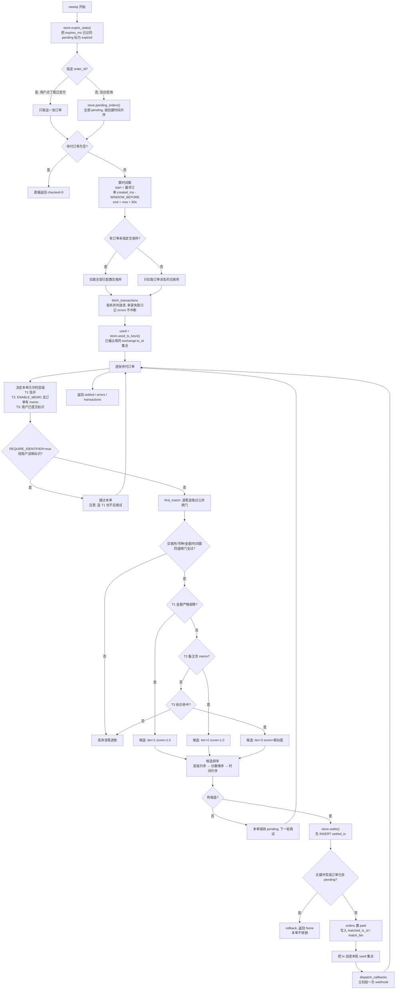

# 自动核销：原理与调参

本文说明 `multi-cex-pay` 是怎么把「交易所里多出来的一笔钱」认成「某一张待付订单」的，
以及每个开关调大调小分别意味着什么。

对应代码：`cexpay/matching.py`（匹配算法）、`cexpay/gateway.py` 的 `sweep()`（调度）、
`cexpay/store.py`（`settled_tx` / `amount_locks` 两张去重表）。

本项目只有只读 API 权限，看不到「谁给我付了钱、付的是哪一单」。
交易所的进账接口只会告诉你「某时刻收到 X USDT，付款方是 Y」。所有核销逻辑都是拿这条信息
去反推订单，所以它是一套概率性的、分层降级的匹配，不是链上支付那种「一个地址一个订单」的
确定性对应。设计目标是让 T1 层在正常情况下覆盖 99% 的单，其余靠用户补一个标识或者商家手动放行。

---

## sweep 的流程

`sweep()` 由后台轮询线程（`CEXPAY_POLL_INTERVAL`，默认 20 秒）触发，
用户在收银台点「我已支付」时也会立刻触发一次单订单版本（`POST /api/orders/{id}/check`）。



几个容易忽略的细节：

- 时间窗只按最早的待付订单算一次，然后一次性把这个区间的进账全拉回来，
  所有订单共用同一批 `Transaction`。挂着一张很老的待付订单会显著放大每轮拉取的数据量。
- 单家交易所报错不影响其它家。错误字符串会出现在 `sweep()` 返回的 `errors` 里，
  也会出现在 `POST /api/orders/{id}/check` 的响应里，前端可以直接展示。
- 每笔进账最多产出一个候选。`find_match` 命中某一层后就 `continue`，
  同一笔钱不会同时以 T1 和 T3 的身份参赛。
- 核销后立刻投一次回调，失败则进入 `0/15s/1m/5m/30m/2h/6h` 的重试阶梯（见 `cexpay/notify.py`）。

---

## T1 唯一金额

下单时 `allocate_unique_amount()` 在商品原价上追加一个尚未被占用的尾数：

```
原价 10        → 应付 10.0001
再来一单 10    → 应付 10.0002
再来一单 10    → 应付 10.0003
```

尾数从 `0.0001` 开始顺序扫描，跳过 `amount_locks` 表里仍在占用的金额。
订单里同时保留 `base_amount`（原价，用于对账）和 `pay_amount`（实付，用于匹配）。

匹配时要求 `tx.amount == order.pay_amount` 严格相等（`_exact_amount`）。
不用容差，容差会让相邻尾数互相污染：容差 0.02 就意味着 200 个尾数槽位彼此重叠。

三家全支持，因为「金额」是任何进账接口都必然返回的字段：
Binance 的 `amount`、OKX 的 `amt`、Bitget 的 `size`。T1 放在第一层就是因为这个，
它不依赖任何交易所的可选字段，不管内部转账还是链上充值，也不需要用户做额外操作。

用户扫码，按收银台显示的金额付款，别的什么都不用做。收银台会把小数位标粗，
提示「金额必须一分不差」。

会失效的几种情况：

| 场景 | 结果 | 应对 |
| --- | --- | --- |
| 用户手输金额时抹掉了尾数（付 10 而不是 10.0001） | T1 不命中，`_amount_ok` 也判为少付 0.0001（在 0.02 容差内），但 T1 要求严格相等，仍然不核销 | 降级到 T3 或人工核销 |
| 用户多付（付 10.01） | T1 不命中；若已提交标识可走 T3 | 收银台强调「请勿改动金额」 |
| 同一价位并发订单超过 9999 笔 | 顺序扫描扫满后随机重试 64 次，仍失败就返回原价，此时两张单金额相同，谁先付谁被核销 | 提高 `CEXPAY_UNIQUE_AMOUNT_DECIMALS`，或缩短 `CEXPAY_ORDER_TTL` 让槽位更快回收 |
| 链上充值被平台按「到账数量」扣费 | 到账金额小于填写金额，T1 必然不命中 | 链上收款场景建议直接依赖 T3 或人工核销 |
| 商品价格本身已经有 4 位小数 | 尾数是加法，见下文「唯一金额的边界」 | 定价保留 2 位小数 |

---

## T2 备注码

`enable_memo_match=true`（默认）时，每张订单在创建时生成一个 6 位数字码（`generate_memo`），
收银台提示用户把它填进转账备注。匹配时 `_memo_hit()` 检查两件事：
备注原文里包含该码，或者把备注里的非数字字符全部剥掉之后包含该码。
后者是为了兼容用户写成 `订单 123-456` 这种形式。

只有 Binance Pay 支持，原因是接口能力差异：

- `GET /sapi/v1/pay/transactions` 的记录里带有转账附言，
  适配器会依次尝试 `note` / `remark` / `orderNote` / `description` 四个键
  （不同 `orderType` 下 Binance 用的键名不一致），取第一个非空值。
- `GET /api/v5/asset/deposit-history`（OKX）返回的是充值记录，字段里有
  `ccy` / `amt` / `ts` / `depId` / `fromWdId`，没有任何附言字段。
  OKX 内部转账在 App 上填的备注不会出现在收款方的充值记录里。
- `GET /api/v2/spot/wallet/deposit-records`（Bitget）同理，只有
  `coin` / `size` / `cTime` / `orderId` / `fromAddress` / `dest`，也没有附言。

所以 `BinanceAdapter.supports_memo = True`，另两家是 `False`。

用户要做的是在币安 Pay 转账页面的「备注 / Note」里填那 6 位数字。
这一步用户经常忘，所以 T2 在实践中是 T1 的补充，不是替代。

会失效的几种情况：

- 备注字段为空。部分 `orderType`（例如通过收款码发起的 `PAY` 单）Binance 不回传附言，
  这时无论用户填没填都读不到，命中率不做保证。
- 用户把备注填在了错误的地方，比如填在 OKX 的转账备注里，那家根本读不到。
- 6 位数字撞进了无关文本。备注是「包含」判断，理论上用户写一串长数字可能误命中别的订单的码。
  概率是 1/10⁶ 量级，还要同时通过金额和时间窗校验，实际可以忽略；
  真的介意可以把 `CEXPAY_MEMO_LENGTH` 调到 8。

---

## T3 付款方标识

用户在收银台填一个能证明「这笔钱是我付的」的标识，通过
`POST /api/orders/{id}/identifier {kind, value}` 提交，服务端存进订单并立刻跑一次 sweep。
每家交易所能拿到的标识不一样，所以 `identifier_spec()` 由适配器自己声明，
前端按它渲染输入框和校验正则。

三种 `kind`：

`payer_name`（Binance）是模糊匹配付款方昵称。`payerInfo.name` 是脱敏的（`Ming*****Li`），
普通编辑距离几乎没用，所以 `string_similarity()` 去掉 `*` 后再比一次、
对包含关系单独加成（`0.1 + 0.9 * 短/长`）、算最长公共子串占比，取三者最大值。
分数 ≥ `CEXPAY_NAME_SIMILARITY`（默认 0.6）才算命中，分数会写进 `match_reason` 供审计。
另外还有两道保险：公共子串至少 2 个字符才计入；脱敏前长度不足 3 个字符位的名字
分数上限被压到 0.5，也就是说默认阈值下「张\*」这种名字永远不会自动命中，
必须走人工核销。

`payer_uid_last3`（Bitget）是付款方 UID 后三位，严格相等。
Bitget 把付款方 UID 放在 `fromAddress`；适配器判断该字段是否为纯数字：
纯数字 = 内部转账，取作 `payer_uid`；否则是链上钱包地址，`payer_uid` 置空。

`withdraw_id_last3`（OKX）是提币申请 ID 后三位，严格相等。
OKX 的内部转账拿不到付款方昵称，但会在 `fromWdId` 里带上付款方那笔「提币申请」的 ID，
用户在 OKX App 的账单里能看到这个号。适配器同时把内部转账的 `from` 字段
（脱敏的手机号/邮箱）填进了 `payer_name`，所以给 OKX 订单提交 `kind=payer_name`
也能匹配，但默认前端不这么做，脱敏手机号的相似度判断噪声太大。

各家依赖的字段和限制：

| 交易所 | kind | 依赖字段 | 限制 |
| --- | --- | --- | --- |
| Binance | `payer_name` | `payerInfo.name` | 昵称脱敏，短名字必然降级 |
| Bitget | `payer_uid_last3` | `fromAddress`（纯数字时） | 仅内部转账，链上充值该字段是钱包地址 |
| OKX | `withdraw_id_last3` | `fromWdId` | 仅内部转账，链上充值该字段为空 |

用户付完款后回到收银台，填一个三位数字（Bitget / OKX）或者自己的昵称（Binance）。
这是唯一需要用户主动输入的环节，也是转化率的主要损耗点，
所以默认 `CEXPAY_REQUIRE_IDENTIFIER=false`，T3 只作为 T1 失手后的兜底。

会失效的几种情况：

- 后三位不唯一。1000 个可能值，只要同时有两笔通过校验的进账后三位相同就会错配。
  时间窗和金额区间已经把候选压得很小，但这仍然是 T3 排在 T1/T2 之后的原因。
- 用户填的是自己的 UID 而不是提币申请 ID，这是 OKX 上最常见的误填。
- 链上充值：Bitget / OKX 的两个标识字段在链上场景直接不可用，只能人工核销。
- 昵称改过，或者用的是子账户付款，相似度过不了阈值。

---

## T4 人工核销

前三层都没命中时，商家在后台 `/admin` 打开订单，点「人工核销」，
选一笔进账（交易所 + `tx_id`）绑定到该订单：

```
POST /api/admin/orders/{order_id}/settle
{"exchange": "okx", "tx_id": "128374652", "note": "客户微信截图确认"}
```

对应 `gateway.manual_settle()`。它与自动核销走的是同一个 `store.settle()`，
所以同样受 `settled_tx` 主键约束：如果这笔流水已经被别的订单用掉了，
接口会直接报错并告诉你是哪张订单占用的（`流水 xxx 已被订单 yyy 使用`）。

人工核销不做金额、时间窗、币种校验，商家自己看到了钱，就是最终裁判。
核销金额记为 `order.pay_amount`，`match_tier=4`，`match_reason` 记你填的 note。
它同样会触发 webhook，下游看到的 payload 与自动核销完全一致。

三家全支持，因为它压根不依赖交易所返回什么。

---

## 支持范围

单元格格式：`支持/不支持 + 依据的字段`。

| 交易所 | 唯一金额 (T1) | 备注码 (T2) | 付款方标识 (T3) | 链上充值 | 内部转账 |
| --- | --- | --- | --- | --- | --- |
| Binance Pay | 支持 · `amount` | 支持 · `note`/`remark`/`orderNote`/`description` | 支持 · `payerInfo.name`（模糊） | 不支持 · `/sapi/v1/pay/transactions` 只含 Pay 流水，不含现货充值 | 支持 · `orderType ∈ {PAY, C2C, CRYPTO_BOX, PAYOUT, REMITTANCE, C2C_HOLDING}` |
| OKX | 支持 · `amt` | 不支持 · `deposit-history` 无附言字段 | 支持 · `fromWdId` 后三位（仅内部转账） | 支持 · `state=2` 且 `fromWdId` 为空 → `channel=on_chain` | 支持 · `fromWdId` 非空 → `channel=internal` |
| Bitget | 支持 · `size` | 不支持 · `deposit-records` 无附言字段 | 支持 · `fromAddress` 后三位（仅 `fromAddress` 为纯数字时） | 支持 · `status=success` 且 `fromAddress` 非数字 | 支持 · `dest=internal` 或 `fromAddress` 为纯数字 |

补充说明：

- Binance 收不到链上充值是当前实现的边界，不是接口不存在。
  要支持得再接 `GET /sapi/v1/capital/deposit/hisrec` 并合并进 `fetch_incoming()`。
  现状下让用户往你的币安地址转 USDT，网关看不见这笔钱，必须人工核销。
- 链上充值有时间风险：TRC20 通常十几秒，ERC20 拥堵时可能几分钟到十几分钟。
  默认 `ORDER_TTL=1800` 够用，但 `POLL_INTERVAL=20` 意味着到账后最多再等 20 秒才核销。
- 只认一种币种。`policy.currency`（默认 USDT）是全局的。OKX 用它填 `ccy` 参数、
  Bitget 填 `coin` 参数，Binance 则是拉回来之后在匹配层用 `tx.currency` 过滤。
  代码不区分链，`chain` 字段只保留在 `Transaction.raw` 里，没有参与匹配。

---

## 共同的校验

`_basic_ok()` 在任何层级判断之前先跑一遍，也就是上面流程图里的四道闸门。
四条全过才有资格进入分层匹配。

### 1. 交易所

订单指定了 `exchange` 时，只接受该所的进账。`exchange=None`（收银台默认）
表示用户可以在任意已配置的交易所付款，代价是 sweep 必须拉取全部交易所，
且一笔进账可能被更多订单竞争。

### 2. 币种

`tx.currency.upper() != order.currency.upper()` 直接否掉。
两边任一为空字符串时跳过该检查（防御接口偶发缺字段）。

### 3. 金额容差与「少付为什么一律不放行」

```python
delta = tx.amount - order.pay_amount
if delta < -policy.amount_tolerance:      # 少付超过容差 → 拒绝
    return False
if policy.max_overpay is not None and delta > policy.max_overpay:
    return False                          # 多付太多 → 也拒绝
```

- 少付：`CEXPAY_AMOUNT_TOLERANCE`（默认 0.02）只是吸收交易所侧的舍入误差，
  不是「打个折也算付了」。差额超过 0.02 **一律不核销**，这是唯一不能商量的方向，
  一个允许少付的网关等于允许任意用户用 0.01 USDT 买走你的商品。
  另外 T1 额外要求金额严格相等，所以少付在 T1 层无论多少都不成立，
  容差只在 T2/T3 层起作用。
- 多付：`CEXPAY_MAX_OVERPAY`（默认 5）防的是把一笔 500 USDT 的大额充值
  误配到一张 9.9 的订单上。超出这个额度不自动核销，进后台人工判断。
  多付的钱在你账户里，不核销不会造成资金损失，误核销才会。

### 4. 时间窗

```
window_start = created_ms - WINDOW_BEFORE * 1000        # 默认 1800s
window_end   = max(expires_ms, created_ms) + WINDOW_AFTER * 1000   # 默认 3600s
```

`WINDOW_BEFORE` 覆盖「用户先付款、后下单」这种真实存在的顺序
（尤其是用户扫了你贴在墙上的静态聚合码，付完才去点下单）。

`WINDOW_AFTER` 在默认流程里几乎不会生效。`sweep()` 开头就调 `expire_stale()`
把 `expires_ms` 已过的订单标为 `expired`，而 sweep 只遍历 `pending` 订单。
订单一过期就退出了匹配池，`WINDOW_AFTER` 给出的那一小时窗口没有订单去消费它。
它的实际作用是给时钟漂移、以及「订单 TTL 很长」的场景留余量。
想让晚付的用户自动核销，要调大的是 `CEXPAY_ORDER_TTL`，不是 `CEXPAY_WINDOW_AFTER`。

### 一笔流水只能核销一张订单

`settled_tx` 的主键是 `(exchange, tx_id)`。`store.settle()` 先 `INSERT` 这张表，
主键冲突（`sqlite3.IntegrityError`）就 rollback 并返回 `None`，订单保持 `pending`。
随后的 `UPDATE orders ... WHERE status = 'pending'` 如果 `rowcount == 0`
（订单已被别的路径核销）同样 rollback。两个检查在一个事务里，
所以「后台轮询 + 用户点我已支付 + 后台人工核销」三条路径同时抢一笔钱时，
只有一条会成功，其余安静失败。

sweep 内部还额外维护一个 `used` 内存集合，本轮刚核销掉的流水立刻加进去，
避免同一批 `Transaction` 在遍历后续订单时被重复选中。

---

## 唯一金额的边界

### 小数位数与槽位数量

`decimals=4` 时槽位是 `0.0001 ~ 0.9999`，共 9999 个。这里的「同一价位」
严格说是「`quantize` 到 4 位后相同的基数」。`locked_amounts()` 是按币种查全部
被占用金额，判重是全局的 `(currency, pay_amount)`，所以相邻价位
（原价 10.0000 与 10.0001）的尾数空间会互相挤占，但不会真的发出两张同额订单。

不够用的时候：

- `CEXPAY_UNIQUE_AMOUNT_DECIMALS=6` → 999999 个槽位。代价是应付金额出现 6 位小数
  （`10.000001`），用户手输更容易抹掉尾数，且部分交易所的金额展示会四舍五入到 4~8 位，
  上线前请在真实账号上验证一次到账金额是不是原样保留。
- 或者缩短 `CEXPAY_ORDER_TTL`，让槽位更快回收。但真正卡住槽位的是冷却而不是 TTL，见下。

### 24 小时冷却

订单创建时写一条 `amount_locks`：

```python
cooldown = max(self.policy.amount_cooldown_s, ttl)   # gateway.create_order
self.store.lock_amount(currency, pay_amount, order.order_id, cooldown)
```

`released_ms = now + cooldown * 1000`，到期后由 `locked_amounts()` 顺手 `DELETE` 清理。

**冷却必须覆盖订单有效期，否则会串单**，这条已经用 `max()` 在代码里兜住了。
光有 TTL 不够、还要额外的 24 小时，是因为：

订单 A 应付 `10.0001`，用户没付，30 分钟后过期。如果此刻立刻释放金额，
下一个下单的用户 B 也拿到 `10.0001`。然后 A 的用户睡醒了，付了 `10.0001`，
这笔钱会精确命中 B 的订单，B 白拿一件商品，A 打了钱却什么都没有。
24 小时冷却把这个窗口拉长到「用户不可能再回来付」的量级。

代价是槽位回收变慢：同一价位在 24 小时内最多只能开出 9999 张单
（4 位小数下）。日均超过这个量的价位需要提高小数位数，而不是降低冷却。

一个已知的小口子：`POST /api/orders/{id}/cancel` 会调 `release_amount()`
立刻释放金额锁。这是为了让误下的单不占槽位，但如果用户取消后又付了款，
同样存在上面那个串单路径。只在你确定用户不会付款时才让前端调 cancel。

### 定价本身已经有 4 位小数

尾数是加法，不是替换：

```python
base = base_amount.quantize(step)     # 12.3456 → 12.3456
candidate = base + step * i           # → 12.3457, 12.3458, ...
```

所以定价 `12.3456` 的商品，实付会落在 `12.3457 ~ 13.3455` 之间，
最坏情况**悄悄多收接近 1 USDT**。定价小数位超过 `UNIQUE_AMOUNT_DECIMALS` 时
还会先被 `quantize` 四舍五入（`ROUND_HALF_EVEN`），`10.00005` 可能变成 `10.0000`。

实践建议：

1. 定价保留 2 位小数，把后两位完全留给尾数分配（等于 99 个可用槽位，够小店用）；
   或保留 0 位小数，拿满 9999 个槽位。
2. 需要精确到 4 位以上的定价（例如按汇率实时换算），把 `UNIQUE_AMOUNT_DECIMALS`
   提到比定价小数位多 2~4 位。
3. 无论如何，对账要用 `base_amount` 而不是 `pay_amount`。
   订单表两个字段都存着，差额就是尾数带来的零头收入，`GET /api/admin/orders` 里能看到。

---

## 调参手册

### 环境变量

| 环境变量 | 默认 | 调大 | 调小 |
| --- | --- | --- | --- |
| `CEXPAY_UNIQUE_AMOUNT` | `true` | 不适用 | 设为 `false` 关掉 T1，所有订单实付 = 原价。只有在你能保证每单都有标识时才这么做，否则同价位订单完全无法区分 |
| `CEXPAY_UNIQUE_AMOUNT_DECIMALS` | `4` | 并发槽位指数级增长（6 位 → 99 万），但金额更长、用户手输更易出错，且要验证交易所是否保留该精度 | 槽位骤减（2 位 → 99 个），高峰期同价位容易撞满 |
| `CEXPAY_AMOUNT_TOLERANCE` | `0.02` | 更宽容用户少付；容差重叠会污染相邻尾数，且给了「故意少付」的空间 | 设为 `0` 即完全不容忍少付，最严格；偶发的交易所舍入会掉进人工核销 |
| `CEXPAY_MAX_OVERPAY` | `5` | 大额多付也自动核销，误把大额充值配到小额订单的风险上升 | 设为 `0` 则任何多付都不自动核销，全部转人工 |
| `CEXPAY_WINDOW_BEFORE` | `1800` | 允许更早的进账参与匹配，覆盖「先付后下单」；同时每轮拉取的数据量变大，跨单误配面变宽 | 拉取更快更精准，但用户先付款的场景会漏 |
| `CEXPAY_WINDOW_AFTER` | `3600` | 基本无效（订单一过期就退出匹配池，见上文）。要放宽晚付请改 `ORDER_TTL` | 同上，几乎无影响 |
| `CEXPAY_ORDER_TTL` | `1800` | 收银台等待更久，晚付也能自动核销；占用金额槽位的时间变长 | 槽位回收快、页面倒计时短；用户稍慢就得人工核销 |
| `CEXPAY_AMOUNT_COOLDOWN` | `86400` | 串单窗口更小、更安全；同价位日承载量下降 | 不建议低于 `ORDER_TTL`，代码会用 `max()` 强行兜住；调低意味着过期未付的用户回头付款可能核销掉别人的单 |
| `CEXPAY_REQUIRE_IDENTIFIER` | `false` | 设为 `true` 后，没提交标识的订单会被整张跳过（连 T1 也不试），自动核销率大幅下降，换来的是每单都有一条人工可核对的证据 | 保持 `false`，T1 静默核销，用户零输入 |
| `CEXPAY_NAME_SIMILARITY` | `0.6` | 昵称匹配更严（0.8 基本只认高度重合的名字），误配少、漏配多 | 更松（0.4 会开始出现「李明」匹配上「李\*华」这类误配）。低于 0.5 时短名字保护（上限 0.5）会失效，风险明显上升 |
| `CEXPAY_ENABLE_MEMO` | `true` | 不适用 | 设为 `false` 则不再生成备注码、T2 全线关闭。只用 OKX/Bitget 时可以关掉，少一个用户看不懂的字段 |
| `CEXPAY_MEMO_LENGTH` | `6` | 8 位几乎排除偶然撞码，用户输入负担略增 | 4 位撞码概率 1/10⁴，配合金额校验仍可接受，但没必要 |
| `CEXPAY_CURRENCY` | `USDT` | 换成别的币种（`USDC` 等）。这是全局单币种设置，改了之后所有订单都只认这一种 | 不适用 |
| `CEXPAY_POLL_INTERVAL` | `20` | 交易所 API 调用更少（更不容易触发限频），到账后核销延迟变长 | 核销更快；三家各自的限频要自己盯着，`0` 则完全关掉轮询、只靠用户点「我已支付」和后台手动 sweep |
| `CEXPAY_HTTP_TIMEOUT` | `15` | 网络差时更少假失败 | 单家卡住时整轮 sweep 更快跳过 |

### 高频小店

一天几十到几百单、金额集中在少数几个价位、不想让用户填任何东西。

```bash
CEXPAY_UNIQUE_AMOUNT=true
CEXPAY_UNIQUE_AMOUNT_DECIMALS=4     # 9999 槽位；单价位日单量过千再上 6
CEXPAY_ORDER_TTL=900                # 15 分钟，槽位回收快，页面不会挂太久
CEXPAY_POLL_INTERVAL=10             # 到账最多 10 秒核销
CEXPAY_REQUIRE_IDENTIFIER=false     # 关键：不给用户加任何输入
CEXPAY_AMOUNT_TOLERANCE=0.02
CEXPAY_MAX_OVERPAY=2                # 小额店铺不需要 5 的宽容度
CEXPAY_WINDOW_BEFORE=900            # 拉取范围小一点，sweep 更轻
CEXPAY_AMOUNT_COOLDOWN=86400
```

配套动作：把定价统一到 2 位小数以内；收银台把「金额必须一分不差」放大；
后台每天扫一眼 `GET /api/admin/orders?status=expired`，看有没有该核销没核销的。

### 大额低频

一天几单、单笔金额大（几百到几千 USDT），错配一次就是真金白银的损失。

```bash
CEXPAY_UNIQUE_AMOUNT=true
CEXPAY_UNIQUE_AMOUNT_DECIMALS=4
CEXPAY_ORDER_TTL=3600               # 大额转账用户会犹豫、会分批确认
CEXPAY_POLL_INTERVAL=30
CEXPAY_REQUIRE_IDENTIFIER=true      # 每单都要有可核对的证据；接受自动核销率下降
CEXPAY_AMOUNT_TOLERANCE=0           # 一分都不能少
CEXPAY_MAX_OVERPAY=0                # 多付一律转人工
CEXPAY_NAME_SIMILARITY=0.8          # Binance 昵称匹配收紧
CEXPAY_WINDOW_BEFORE=600
CEXPAY_AMOUNT_COOLDOWN=259200       # 3 天，彻底消除晚付串单
```

`REQUIRE_IDENTIFIER=true` 的真实含义是：用户不填标识，这张订单在 sweep 里
**会被整张跳过**，即使他付的金额和唯一尾数完全对得上也不会自动核销。
这是刻意的，大额场景下宁可让商家人工点一下，也不要机器自己认。
上了这个开关就必须有人看后台。

---

## 排查指南：钱到账了但订单没核销

按顺序走，每一步都能自己给出结论，不用猜。

1. 确认钱真的进了被网关监控的那个账户。
   常见坑：用户把钱打到了 Binance 的现货充值地址而不是 Pay。
   本项目的 Binance 适配器只读 `/sapi/v1/pay/transactions`，
   链上充值到现货钱包的记录它看不见（见上文支持范围）。这种情况只能人工核销。

2. 确认订单还是 `pending`。
   `GET /api/orders/{id}`，看 `status`。已经是 `expired` 就不会再被 sweep 碰到，
   哪怕钱在时间窗内到账。这是最常见的原因，尤其是默认 30 分钟 TTL 下用户去凑币了。

3. 确认币种和交易所对得上。
   同一份响应里看 `currency` 和 `exchange`。订单锁定了 `exchange=binance` 而用户在 OKX 付款，
   第一关就否掉了。收银台默认不锁交易所，但通过 API 下单时容易手写死。

4. 核对金额到最后一位小数。
   `pay_amount` 是 `10.0001` 而用户付了 `10`，T1 不成立。
   少付超过 `CEXPAY_AMOUNT_TOLERANCE`、或多付超过 `CEXPAY_MAX_OVERPAY`，
   连公共校验都过不去。

5. 看 sweep 有没有报错。
   `POST /api/orders/{id}/check`（用户视角的「我已支付」）会返回
   `{"is_paid": ..., "scanned": N, "errors": [...]}`。
   `scanned=0` 说明这一轮压根没拉到任何进账，通常是 API Key、passphrase、
   IP 白名单或者系统时间的问题（三家的签名都带时间戳，机器时钟偏移超过几秒就会被拒）。
   `errors` 非空时里面就是交易所返回的原始错误码。

6. 验一下凭据和权限。
   `POST /api/admin/credentials/test?exchange=okx`，或命令行 `cexpay creds test`。
   顺手确认 Key 是只读的（`CEXPAY_ENFORCE_READONLY=true` 时带写权限的 Key
   会直接让服务启动失败）。

7. 看这笔流水是不是已经被别的订单占用了。
   如果它已经在 `settled_tx` 里，`store.settle()` 会静默失败。
   日志里会有一行 `订单 xxx 核销未生效（流水 yyy 已被占用或订单状态已变）`。
   人工核销接口会更直接地告诉你是哪张订单拿走了：
   `核销失败：流水 xxx 已被订单 yyy 使用`。

8. 调 `CEXPAY_LOG_LEVEL=DEBUG` 重跑一轮。
   `POST /api/admin/sweep` 手动触发全量核销，看返回的
   `checked` / `transactions` / `settled` / `errors` 四个数字。
   `transactions > 0` 但 `settled` 为空，说明钱拉到了、校验没过，回到第 3~4 步。

9. 直接看交易所到底返回了什么。

   ```
   GET /api/admin/transactions?minutes=240&exchange=okx
   Authorization: Bearer $CEXPAY_ADMIN_TOKEN
   ```

   它把 `fetch_transactions()` 的原始结果按时间倒序摊开，
   每条带 `tx_id` / `amount` / `currency` / `timestamp_ms` / `channel`
   以及能拿到的 `payer_name` / `payer_uid` / `withdraw_id` / `memo`。
   在这里能看出：钱到没到、金额差在哪一位、`channel` 是
   `internal` 还是 `on_chain`（决定了 T3 那个字段有没有值）、时间戳落在窗口内外。

10. 确认无误就人工核销。
    后台 `/admin` 页面上，订单行有「人工核销」按钮。
    从上一步的列表里复制 `exchange` 和 `tx_id`，填个备注说明依据（截图、聊天记录），
    点确认。等价于：

    ```
    POST /api/admin/orders/{order_id}/settle
    {"exchange": "okx", "tx_id": "128374652", "note": "客户提供转账截图，金额时间吻合"}
    ```

    订单立刻变 `paid`，`match_tier=4`，webhook 照常投递，下游拿到的 payload
    和自动核销一模一样。`settled_tx` 会记下这笔流水，之后不会再被别的订单用掉。

如果第 9 步在 `/api/admin/transactions` 里根本看不到这笔钱，
那就不是核销的问题，是「网关监控的账户」和「用户实际转入的账户/通道」不一致，
回到第 1 步。
